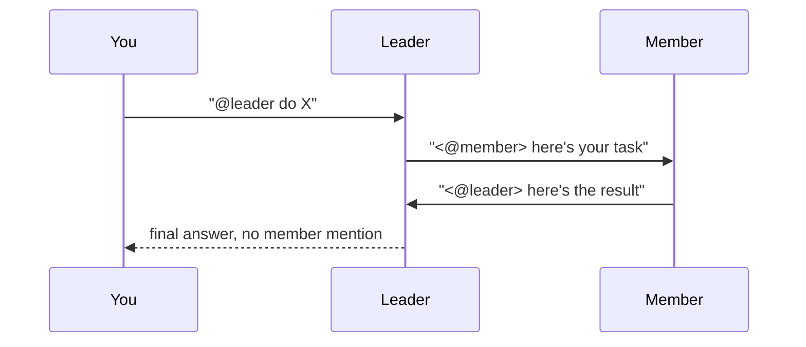

# Setting up a Hermes team

If you've deployed one Hermes instance and now want more than one agent working
together, this page is the on-ramp. It explains the idea in plain terms first,
then walks you through the two team shapes you can build, with the smallest
possible example of each. For the exhaustive protocol, every knob, and the
live-verified evidence, see [Hermes teams](reference.md) and
[Hermes collaboration](collaboration.md) - this page exists to get
you oriented before you read those.

## The one thing to understand first

**You cannot make one Hermes "bigger" by raising `replicaCount`.** Hermes Agent
is a personal agent: one identity, one memory, one home directory, one gateway
process. Extra replicas either sit `Pending` (they fight over the same disk) or
become totally separate, disconnected agents that don't know about each other.

So a "team" in this chart is never one deployment scaled out. It is always
**several independent single instances, each its own Helm release**, joined
together by something they share - most commonly, one Discord channel or
thread. Think of it less like scaling a server and more like hiring a second
person: they get their own desk (PVC), their own identity, and you introduce
them to the same group chat.

## Two shapes, pick based on what you need

| | **Pair collaboration** | **Leader-orchestrated team** |
| --- | --- | --- |
| Who talks to whom | Any agent may address any other agent | Only the leader talks to the human; members only ever answer the leader |
| Shape | Flat: two (or a few) peers | Star: one leader, N members |
| Best for | A quick two-role pairing (e.g. planner + builder) that you'll watch closely | A repeatable, larger roster where you want one predictable point of contact |
| Where it's documented | [collaboration.md](collaboration.md) | [teams.md](reference.md#leader-orchestrated-teams) |
| Values files | [`values-multi-agent-collab.yaml`](https://github.com/jyje/hermes-agent-helm/blob/main/charts/hermes-agent/values-multi-agent-collab.yaml) | [`values-team-leader.yaml`](https://github.com/jyje/hermes-agent-helm/blob/main/charts/hermes-agent/values-team-leader.yaml) / [`values-team-member.yaml`](https://github.com/jyje/hermes-agent-helm/blob/main/charts/hermes-agent/values-team-member.yaml) |

Neither is "more advanced" than the other - pick the shape that matches how you
want the conversation to flow. A flat pair is simpler to reason about with two
agents; once you're past two or three, the leader shape keeps the human from
having to track who's doing what.

## Quick start: a collaborating pair

Two independent releases, one shared Discord channel, and an explicit
`@mention` as the handoff signal.

1. **Create two bots** in the [Discord Developer Portal](https://discord.com/developers/applications),
   enable the Message Content Intent on both, and invite both to the same
   channel. Note each bot's Discord **user ID** - each agent needs to know its
   partner's ID to mention them.
2. **Install both**, pointing each at [`values-multi-agent-collab.yaml`](https://github.com/jyje/hermes-agent-helm/blob/main/charts/hermes-agent/values-multi-agent-collab.yaml)
   with its own bot token and its partner's ID filled into `environment_hint`:

   ```bash
   helm upgrade --install hermes-planner ./charts/hermes-agent \
     --namespace hermes-team --create-namespace \
     -f charts/hermes-agent/values-multi-agent-collab.yaml \
     --set-string env.DISCORD_BOT_TOKEN='<planner-bot-token>' --wait

   helm upgrade --install hermes-builder ./charts/hermes-agent \
     --namespace hermes-team --create-namespace \
     -f charts/hermes-agent/values-builder.yaml \
     --set-string env.DISCORD_BOT_TOKEN='<builder-bot-token>' --wait
   ```

3. **Talk to either bot in the channel.** Ask the planner to scope something;
   when it hands off with `<@builder>` in its reply, the builder picks it up
   automatically. When a topic wraps up, the agent that's finishing addresses
   you instead of mentioning its partner - that's what stops the exchange.

That's the whole loop. The full recipe - why four specific Discord environment
variables are what makes "stop mentioning when you're done" actually
enforceable, and how to scale past two agents - is in
[collaboration.md](collaboration.md).

## Quick start: a leader-orchestrated team

One leader the human always talks to, and members who only ever act on an
explicit mention from the leader.



1. **Provision a shared knowledge volume** (optional but recommended): an
   `ReadWriteMany` PVC named `hermes-team-knowledge` that the leader writes to
   and members read. It's for durable reference material, never for live task
   state; the Discord thread is what actually carries the work.
2. **Install the leader**, then one release per member, all pointed at the
   same Discord channel:

   ```bash
   helm upgrade --install hermes-august ./charts/hermes-agent \
     --namespace hermes-team --create-namespace \
     -f charts/hermes-agent/values-team-leader.yaml \
     --set-string env.DISCORD_BOT_TOKEN='<leader-bot-token>' --wait

   helm upgrade --install hermes-may ./charts/hermes-agent \
     --namespace hermes-team \
     -f charts/hermes-agent/values-team-member.yaml \
     --set-string env.DISCORD_BOT_TOKEN='<member-bot-token>' --wait
   ```

3. **Give the leader a goal in the channel.** It delegates to one member at a
   time, waits for that member's reply, reviews it, and either asks for a
   revision or moves to the next member. When everything's satisfied, it
   answers you directly with no member mention - that's the signal the run is
   done. `examples/argocd/hermes-team.yaml` has the declarative (ArgoCD)
   version of the same roster if you'd rather not run `helm install` by hand.

The full protocol - the exact delegation message format, why the loop brake
needs four specific env vars, and what's actually been proven live on a real
cluster - is in [Hermes teams](reference.md#leader-orchestrated-teams).

## Why the safety rails exist

Hermes has **no built-in limiter on bot-to-bot conversation** - two agents that
can see and mention each other will, left unchecked, ping-pong forever. Every
team pattern on this page relies on the same two-layer brake to make "stop"
actually happen:

- **A prompt instruction**: each agent is told explicitly when *not* to mention
  a partner (when a topic is resolved, address the human instead).
- **Four Discord environment variables** that make the *only* way to trigger a
  partner an explicit `<@id>` written into the message body - not a reply, not
  passive presence in a thread, nothing implicit. This closes off the subtle
  way Discord replies otherwise auto-ping the previous sender and restart the
  loop by accident.

This is called out everywhere as **experimental and not an upstream-supported
topology** - treat it as a recipe with mitigations, not a guarantee, and keep
these bots in a channel you can watch.

## Other platforms: Telegram and Slack

Everything above uses Discord, which is the only platform with a live-proven
multi-bot run behind it. The protocol itself is platform-independent, though:
what changes is how you write a mention and which environment variables close
the loop:

| | Discord | Telegram | Slack |
| --- | --- | --- | --- |
| Mention format | `<@USER_ID>` | `@username` (must end in `bot`) | `<@USER_ID>`: identical to Discord |
| Loop-brake knobs | 4 | 3 | 2 |
| The one to not miss | `DISCORD_REPLY_TO_MODE=off` | `TELEGRAM_REPLY_TO_MODE=off` | `SLACK_STRICT_MENTION=true` |
| Live-proven | ✅ | ⚠️ config-verified only | ⚠️ config-verified only |

Slack is the easiest port (same mention markup, so `environment_hint` text
carries over unchanged); Telegram needs `@username` tokens instead of numeric
IDs plus one extra instruction telling agents never to use Telegram's native
"reply" to address a teammate.

Full knob-by-knob mapping and worked config for both is in
[collaboration.md § Beyond Discord](collaboration.md#beyond-discord-telegram-and-slack)
(pair) and [teams.md § Telegram and Slack](reference.md#telegram-and-slack)
(leader team).

## What's actually been proven, not just documented

Two live runs on a real kind cluster (pinned Hermes image `v2026.7.20`)
completed the full leader → member → member → leader route end-to-end, with
no member mention on the final answer - confirming the loop genuinely
terminates. See [teams.md § Live evidence](reference.md#live-evidence)
for both Discord thread links and timings.

## Where to go from here

- [Hermes teams](reference.md) - the complete reference: the "why a
  single instance" rationale, the ArgoCD ApplicationSet pattern for larger
  rosters, and the full leader-team protocol.
- [Hermes collaboration](collaboration.md): the complete pair
  recipe: mixed model backends, where partner IDs should live (declarative vs.
  learned in conversation), and the multi-agent ApplicationSet variant.
- [Roadmap](../../about/roadmap.md): what's proven vs. still in progress
  across both team shapes.
