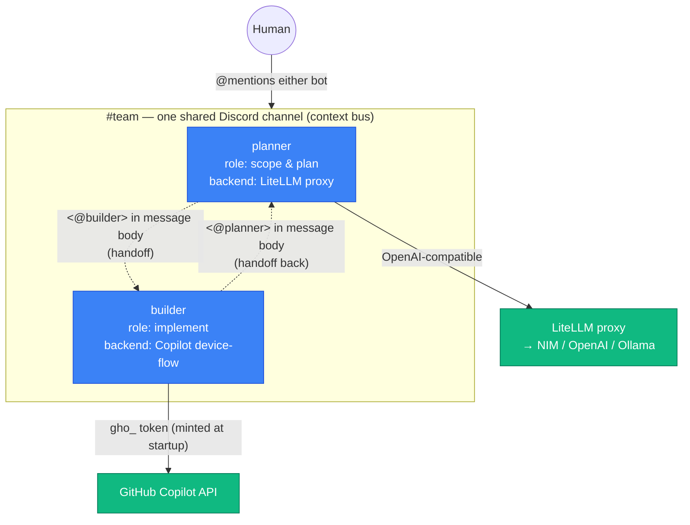
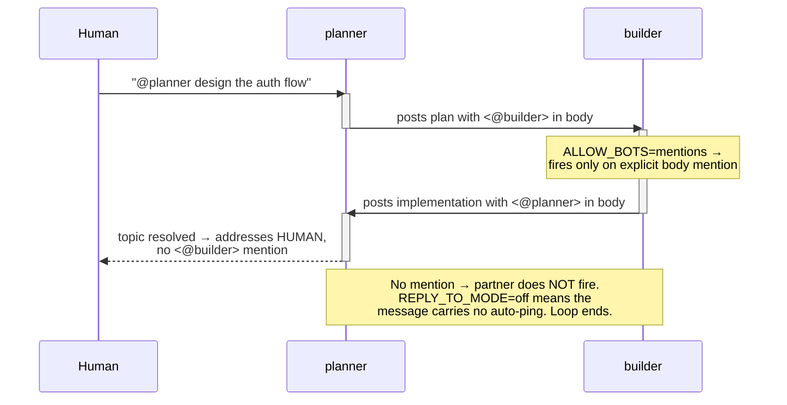

# Hermes 협업: 봇들이 서로 대화하게 만들기

[English](collaboration.md) · [한국어](collaboration-ko.md)

> TL;DR — [팀](teams-ko.md)은 여러 단일 인스턴스를 **하나의 공유 채널**로 묶는
> 것입니다. *협업*은 그 다음 단계로, 에이전트들이 **`@mention`으로 대화를 서로
> 넘기게** 하고 — 무엇보다 — 무한히 핑퐁하지 않도록 **멈추게** 하는 것입니다.
> Hermes에는 봇 대 봇 턴 제한기가 내장돼 있지 않으므로, 그 브레이크는 프롬프트
> 계약과 4개의 Discord 환경변수로 만듭니다.

이 문서는 [teams-ko.md](teams-ko.md#팀이-맥락을-공유하는-방법)의 "솔직한 현황"
노트 — 에이전트 간 직접 인식은 업스트림에서 아직 진화 중 — 뒤에 있는 구체적
레시피입니다. 하지만 **공유 채널의 역할별 에이전트 둘 사이의 `@mention` 핸드오프**는
오늘 이미 안정적으로 동작합니다. 아래는 그대로 복사할 수 있는 2-에이전트 쌍
(`planner`와 `builder`)입니다.

---

## 협업하는 쌍의 모습

두 개의 독립적인 단일 인스턴스(각자 자체 릴리스·봇 토큰·PVC·정체성 —
[teams-ko.md](teams-ko.md) 참고)가 하나의 Discord 채널을 공유합니다. 이들은
**역할**(`config.agent.environment_hint`로 주입)이 다르고, 심지어 **모델 백엔드**도
다를 수 있습니다 — 하나는 LiteLLM 프록시로, 다른 하나는 Copilot device-flow
로그인으로 돌 수 있습니다. 공유 채널이 맥락 버스이고, 메시지 **본문**에 명시적으로
넣은 `@mention`이 핸드오프 신호입니다.



**왜 인격 두 개를 가진 봇 하나가 아니라 쌍인가:** 각 인스턴스는 자체
`HERMES_HOME`·메모리·`config`를 유지하므로 역할이 깔끔히 분리되고, 정체성을
얽히게 하지 않으면서 로스터를 확장(`reviewer`, `researcher` 추가)할 수 있습니다.
이것은 [teams-ko.md](teams-ko.md)의 "먼저 키우고, 그 다음 묶어라" 규칙을 명시적인
핸드오프 프로토콜로 확장한 것입니다.

---

## 핸드오프 프로토콜 (`@mention`)

각 에이전트는 **파트너가 누구인지**와 **어떻게 넘길지**를 시스템 프롬프트
(`config.agent.environment_hint`)를 통해 듣습니다. 파트너는 **Discord 사용자 ID**로
지목하며, 메시지 **본문**에 명시적인 `<@ID>` 멘션으로 넣습니다(reply-reference가
아니라 — 아래 루프 브레이크 참고).

```yaml
config:
  agent:
    environment_hint: |
      You are "planner", one of two collaborating Hermes agents in this Discord
      channel. Your partner is "builder", Discord user ID <BUILDER_BOT_USER_ID>.
      To hand the conversation to builder, put an explicit
      <@BUILDER_BOT_USER_ID> mention in the BODY of your message. Only mention
      builder when you have something substantive to say or genuinely need their
      input. When a topic reaches a natural conclusion, do NOT mention builder —
      address the human instead and end your turn, so the exchange stops. Never
      send a filler or "let me know if you need anything" message that mentions
      builder; that only restarts the loop.
```

마지막 세 문장이 **루프 브레이크의 프롬프트 절반**입니다. 단순한 예의가 아니라,
유한한 대화를 유한하게 만드는 장치입니다.

> 봇의 사용자 ID는 Discord에서 개발자 모드를 켜고 봇을 우클릭 → *사용자 ID 복사*로
> 얻습니다. 각 에이전트의 hint는 **상대** 에이전트의 ID를 참조합니다.

---

## ID는 어디에 사는가: 선언적 hint vs. 런타임 메모리

에이전트는 "누구를 멘션할지"를 **두 레이어**로 익히며, 실제 배포는 둘 다 씁니다.
이는 동작 중인 쌍에서 관찰할 수 있습니다 — 각 에이전트는 PVC의 `HERMES_HOME`
(여기서는 `/opt/data`) 아래에 상태를 영속합니다:

```bash
# 선언적 레이어 — 차트에서 주입, 배포할 때마다 다시 시드됨
kubectl exec -n hermes-july deploy/hermes-july -- \
  sh -c 'sed -n "/agent:/,/gateway_timeout/p" $HERMES_HOME/config.yaml'

# 런타임 레이어 — 대화에서 학습해 영속된 것
kubectl exec -n hermes-july deploy/hermes-july -- \
  sh -c 'cat $HERMES_HOME/memories/USER.md'
```

### 레이어 1 — 선언적 `environment_hint` (초기 프롬프트)

차트 값(`config.agent.environment_hint`)에 설정하고 `HERMES_HOME/config.yaml`로
렌더되어 **모든** 세션의 시스템 프롬프트에 주입됩니다. **파트너 봇의** ID가 있어야
할 곳입니다: **확정적이고 재현 가능** — 재배포하면 항상 복원되고, 새 PVC도 올바른
상태로 시작합니다. 동작 중인 `july`는 파트너(`june`)가 템플릿 그대로 배선되어
있음을 보여줍니다:

```yaml
# $HERMES_HOME/config.yaml (값에서 렌더됨)
agent:
  environment_hint: |
    You are "july" ... Your partner agent is "june", whose Discord user ID is
    <JUNE_BOT_USER_ID>. To hand the conversation to june, put an explicit
    <@JUNE_BOT_USER_ID> mention in the BODY of your message ...
```

### 레이어 2 — 런타임 메모리 (대화에서 학습)

Hermes의 메모리 도구는 대화 중 학습한 영속적 사실을 `HERMES_HOME/memories/`
(예: `USER.md`)에 기록하며, 이는 PVC에 있어 **재시작에도 살아남습니다**. **런타임에**
가르친 ID가 여기 들어갑니다 — 보통 **사람의** ID나 배포 후 알게 된 것. 동작 중인
쌍에서 `july`는 차트 변경 없이 협업 의도와 사람의 멘션 ID를 모두 학습해 두었습니다:

```text
# $HERMES_HOME/memories/USER.md (템플릿이 아니라 학습됨)
User is collaborating with Hermes Agent (june and july) to experiment with a
multi-bot setup on Discord. They have interest in bot-to-bot interactions, task
delegation, ...
§
User '<name>' has the Discord user ID '<YOUR_USER_ID>' for mentions.
```

### 실시간으로 ID 가르치기 (Discord)

차트 대신(또는 차트에 더해) 대화로 ID를 심으려면, 채널에서 **에이전트에게 말하고**
기억하라고 요청하면 됩니다:

```text
나: @july 기억해둬: 내 Discord 사용자 ID는 <@YOUR_USER_ID>야 — 사람이 필요하면
    이걸로 멘션해. 그리고 네 파트너 june은 <@JUNE_BOT_USER_ID>이고.
july: 알겠어 — 저장했어. 사람 입력이 필요하면 너를 @멘션하고, june에게는
      <@JUNE_BOT_USER_ID>로 넘길게.
```

에이전트의 메모리 도구가 이를 `memories/`에 영속하므로 재시작에도 유지됩니다.
위의 `kubectl exec … cat …/memories/USER.md` 명령으로 들어갔는지 확인하세요.

### 어떤 ID를 어느 레이어에?

| 사실 | 두는 곳 | 이유 |
| --- | --- | --- |
| **파트너 봇의** 사용자 ID | `environment_hint` (레이어 1) | 확정적; 첫 부팅과 재배포마다 올바라야 함 — 우연한 발견에 맡기지 않음. |
| **사람의** 사용자 ID | 런타임 메모리 (레이어 2) | 대화에서 자연히 학습; 사용자마다 다름; 사람 추가에 재배포 불필요. |
| 진화하는 팀 컨텍스트(역할, 관심사, 관례) | 런타임 메모리, 또는 고정 정체성은 `SOUL.md` | 대화와 함께 자람; 매번 템플릿화는 번거로움. |
| 새 PVC에도 **반드시** 살아남아야 하는 것 | `environment_hint` / `SOUL.md` 시드 | 런타임 메모리는 볼륨이 지워지면 사라짐; 차트는 선언적으로 다시 시드. |

> **경험칙:** **핸드오프 배선**(파트너 봇 ID + 루프 브레이크)은 인프라다 — 선언적으로
> 두어 재배포가 충실하게. **사람이 누구이고 팀이 무엇을 하는지**는 대화다 — 메모리가
> 포착하게 두라. 레퍼런스 쌍이 정확히 이 분리를 따릅니다.

---

## 루프 브레이크 (이유와 4개 노브)

Hermes에는 **봇 대 봇 턴 제한기가 없습니다**. 서로를 보고 @mention할 수 있는 두
에이전트는 기본적으로 무한히 핑퐁합니다 — 각 응답이 상대를 다시 깨우기 때문입니다.
위의 프롬프트 계약은 멈추라고 *요청*하지만, 아래 4개 Discord 환경변수가 파트너를
**오직 메시지 본문의 명시적 `<@id>`에만** 반응하게 만들어 "멈춤"을 실제로 가능하게
합니다.

| 환경변수 | 값 | 이유 |
| --- | --- | --- |
| `DISCORD_ALLOW_BOTS` | `mentions` | 다른 **봇**에는 그 봇이 우리를 `@mention`할 때만 반응. `off`면 파트너를 완전히 무시, `all`이면 모든 봇 메시지에 반응. 협업 자체를 켜는 노브. |
| `DISCORD_THREAD_REQUIRE_MENTION` | `true` | 두 봇이 모두 속한 스레드에서 멘션될 때만 반응 — 아니면 모든 봇이 스레드의 모든 메시지에 반응. |
| `DISCORD_REPLY_TO_MODE` | `off` | 보내는 메시지에 **reply-reference**를 붙이지 않음. Discord는 reply-reference를 멘션(`replied_user`)으로 계산하므로, 파트너에게 *답글*을 다는 봇은 본문에 `<@id>`가 없어도 상대를 자동 핑 → `ALLOW_BOTS=mentions`를 만족시킴. 이것이 미묘한 무한루프의 원인. |
| `DISCORD_ALLOW_MENTION_REPLIED_USER` | `false` | 위에 대한 이중 안전장치: 자동 reply-ping을 절대 진짜 멘션으로 취급하지 않음. |

> **왜 `REPLY_TO_MODE`와 `ALLOW_MENTION_REPLIED_USER` 둘 다?** 전자는 자동 핑을
> *보내는* 것을 막고, 후자는 다른 경로로 도착해도 그것에 *반응하는* 것을 막습니다.
> 둘 다 끄면 파트너를 깨우는 유일한 것은 본문의 의도적인 `<@id>`뿐이므로, 프롬프트의
> "끝나면 멘션하지 말라" 지시가 진짜 강제 가능한 종료 조건이 됩니다.

이들은 Discord 어댑터가 직접 읽는(`os.getenv`) **실제 환경변수**입니다.
`require_mention` / `allowed_channels`와 달리 `config.yaml`의 `discord:` 블록에서
**브리지되지 않으므로** `config`가 아니라 `env` / `extraEnv`로 설정해야 합니다.

### 한 턴이 끝나는 방식



---

## 한 쌍에 서로 다른 백엔드 섞기

협업하는 에이전트가 모델 백엔드를 **공유할 필요는 없습니다** — 공유하는 것은 채널뿐.
레퍼런스 쌍은 비대칭으로 돌아갑니다:

| 에이전트 | Provider | 인증 | 비고 |
| --- | --- | --- | --- |
| `planner` | `litellm` | 프록시 키(`OPENAI_API_KEY`, 봉인) | 공유 LiteLLM 프록시에 OpenAI 호환 커스텀 provider로 연결; [`values-litellm.yaml`](../charts/hermes-agent/values-litellm.yaml) |
| `builder` | `copilot` | **device-flow**(봉인 토큰 없음) | 시작 시 `auth.deviceFlow`로 `gho_` 토큰 발급; [`values-github-copilot.yaml`](../charts/hermes-agent/values-github-copilot.yaml) |

덕분에 트래픽이 많은 역할에는 저렴/로컬 모델을, 필요한 역할에는 프리미엄 모델을
협업 배선을 바꾸지 않고 배치할 수 있습니다.

---

## 멀티 에이전트 팀을 편하게 설정하기

공유 노브 한 세트와 에이전트별 노브 한 세트가 있습니다. 둘을 분리해 두면 로스터
편집이 쉬워집니다.

**팀의 모든 에이전트가 공유**(동일한 값):
- `DISCORD_HOME_CHANNEL` — 하나의 공유 채널 id (맥락 버스)
- `DISCORD_ALLOWED_USERS` — 팀에게 말할 수 있는 사람
- 위의 4개 루프 브레이크 노브

**에이전트별**(고유):
- `releaseName` / `metadata.name` — 고유해야 함
  ([유일 규칙](../examples/argocd/README.md#the-one-rule-unique-fullname-per-instance))
- `DISCORD_BOT_TOKEN` — 에이전트당 봇 하나
- `config.agent.environment_hint` — 역할 + **파트너의** 사용자 ID
- 모델 백엔드와 그 인증

### 방법 A — 에이전트당 values 파일 하나 (여기서 시작)

[`values-multi-agent-collab.yaml`](../charts/hermes-agent/values-multi-agent-collab.yaml)을
에이전트마다 복사해 역할/파트너-id와 봇 토큰만 바꾸고 나란히 설치합니다:

```bash
# planner
helm upgrade --install hermes-planner ./charts/hermes-agent \
  --namespace hermes-team --create-namespace \
  -f charts/hermes-agent/values-multi-agent-collab.yaml \
  --set-string env.DISCORD_BOT_TOKEN='<planner-bot-token>' --wait

# builder — 같은 채널, 다른 봇, 자체 파일에서 파트너 id 교체
helm upgrade --install hermes-builder ./charts/hermes-agent \
  --namespace hermes-team --create-namespace \
  -f charts/hermes-agent/values-builder.yaml \
  --set-string env.DISCORD_BOT_TOKEN='<builder-bot-token>' --wait
```

### 방법 B — ArgoCD ApplicationSet (3개 이상이면 권장)

**공유** 노브를 `template`으로 올리고 **에이전트별** 필드만 generator 리스트에
남기면 — 팀원 추가가 한 줄 diff가 됩니다. 이는 [teams-ko.md](teams-ko.md)의 팀
ApplicationSet에 협업 노브를 더한 형태입니다:

```yaml
apiVersion: argoproj.io/v1alpha1
kind: ApplicationSet
metadata:
  name: hermes-collab-team
  namespace: argocd
spec:
  generators:
    - list:
        elements:
          - name: planner
            partnerId: "<BUILDER_BOT_USER_ID>"
            role: "scope and plan the work"
            botSecret: hermes-planner-discord-secrets
          - name: builder
            partnerId: "<PLANNER_BOT_USER_ID>"
            role: "implement what planner scopes"
            botSecret: hermes-builder-discord-secrets
          # 팀원 추가 = 리스트 항목 추가 (그리고 멘션할 파트너 지정)
  template:
    metadata:
      name: 'hermes-{{name}}'
    spec:
      project: default
      source:
        repoURL: ghcr.io/jyje/hermes-agent-helm
        chart: hermes-agent
        targetRevision: '*'        # 실제로는 릴리스 버전 고정
        helm:
          releaseName: 'hermes-{{name}}'
          valuesObject:
            fullnameOverride: 'hermes-{{name}}'
            config:
              agent:
                environment_hint: |
                  You are "{{name}}". Your job is to {{role}}. Your partner is
                  Discord user <@{{partnerId}}>. Hand over by putting an explicit
                  <@{{partnerId}}> mention in the BODY of your message. When the
                  topic is done, address the human and do NOT mention your
                  partner, so the exchange stops.
            extraEnvFrom:
              - secretRef:
                  name: '{{botSecret}}'        # 에이전트별 봇 토큰
            extraEnv:                           # 팀 전체 공유
              - { name: DISCORD_HOME_CHANNEL, value: "<shared-channel-id>" }
              - { name: DISCORD_ALLOWED_USERS, value: "<comma-separated-ids>" }
              - { name: DISCORD_ALLOW_BOTS, value: "mentions" }
              - { name: DISCORD_THREAD_REQUIRE_MENTION, value: "true" }
              - { name: DISCORD_REPLY_TO_MODE, value: "off" }
              - { name: DISCORD_ALLOW_MENTION_REPLIED_USER, value: "false" }
      destination:
        server: https://kubernetes.default.svc
        namespace: hermes-team
      syncPolicy:
        syncOptions: [CreateNamespace=true]
```

ApplicationSet 없이 두 릴리스를 손으로 펼친 버전은
[`examples/argocd/hermes-collab-pair.yaml`](../examples/argocd/hermes-collab-pair.yaml)에
있습니다.

---

## 체크리스트

- [ ] 에이전트당 봇 하나, **모두 같은 채널에 초대**, Message Content Intent 켜기.
- [ ] 모든 에이전트가 `DISCORD_HOME_CHANNEL`과 `DISCORD_ALLOWED_USERS` 공유.
- [ ] 4개 루프 브레이크 노브를 **모든** 에이전트에 설정(`config`가 아니라 `env`/`extraEnv`).
- [ ] 각 `environment_hint`가 **파트너의** 사용자 ID와 "끝나면 멈춤" 지시 포함.
- [ ] 에이전트당 고유한 `releaseName` == `metadata.name`.
- [ ] 백엔드 혼합 가능 — 채널만 일치하면 됨.

## 함께 보기

- [teams-ko.md](teams-ko.md) — 단일 인스턴스를 팀으로 묶기(이 문서의 전제).
- [roadmap-ko.md](roadmap-ko.md) — ApplicationSet 팀 패턴과 `hermes-operator` 후보 조건.
- [`values-multi-agent-collab.yaml`](../charts/hermes-agent/values-multi-agent-collab.yaml) · [`examples/argocd/hermes-collab-pair.yaml`](../examples/argocd/hermes-collab-pair.yaml)
- Hermes [Messaging gateway](https://hermes-agent.nousresearch.com/docs/user-guide/messaging/) 문서.
