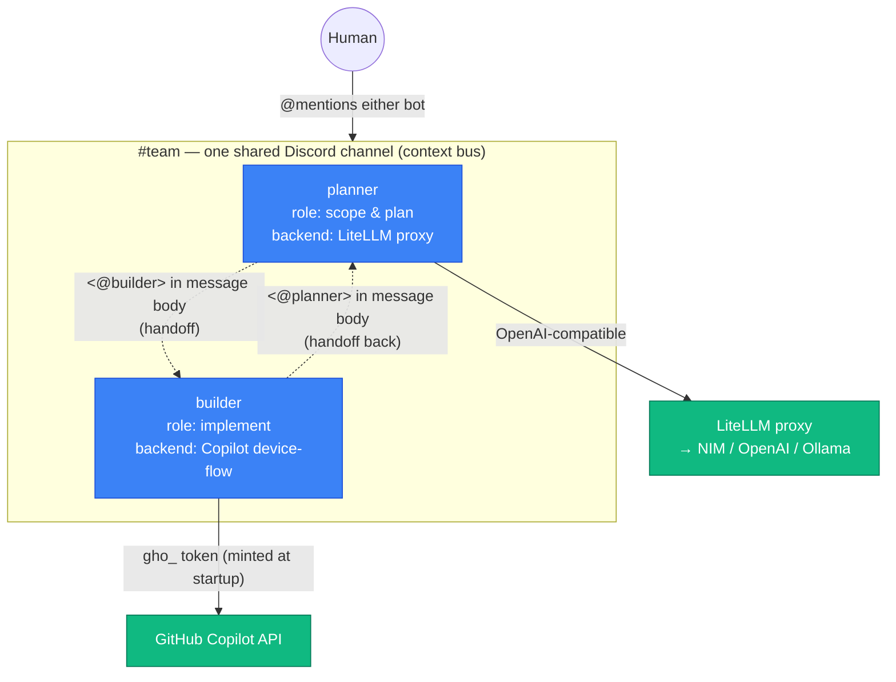
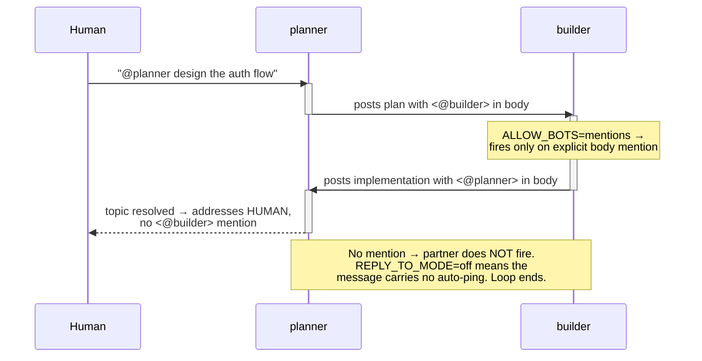

# Hermes collaboration: make the bots talk to each other

[English](collaboration.md) · [한국어](collaboration-ko.md)

> TL;DR — A [team](teams.md) groups several single instances into **one shared
> channel**. *Collaboration* is the next step: letting those agents **hand the
> conversation to each other by `@mention`** — and, crucially, **stopping** them
> from ping-ponging forever. Hermes has no built-in bot-to-bot turn limiter, so
> the brake is a prompt contract plus four Discord env knobs.

This page is the concrete recipe behind the "honest status" note in
[teams.md](teams.md#how-a-team-shares-context): direct agent-to-agent awareness
is still evolving upstream, but a **`@mention` handoff between two role-scoped
agents in a shared channel** works reliably today. Below is a working two-agent
pair (a `planner` and a `builder`) you can copy.

---

## What a collaborating pair looks like

Two independent single instances (each its own release, bot token, PVC, and
identity — see [teams.md](teams.md)) share one Discord channel. They differ in
**role** (injected via `config.agent.environment_hint`) and may even differ in
**model backend** — one can run on a LiteLLM proxy while the other uses a
Copilot device-flow login. The shared channel is the context bus; an explicit
`@mention` in the message **body** is the handoff signal.



**Why a pair, not one bot with two personalities:** each instance keeps its own
`HERMES_HOME`, memory, and `config` — so roles stay cleanly separated and you can
scale the roster (add a `reviewer`, a `researcher`) without entangling identities.
This is the same "scale up, then group" rule from [teams.md](teams.md), extended
with an explicit handoff protocol.

---

## The handoff protocol (`@mention`)

Each agent is told **who its partner is** and **how to hand over** through the
system prompt, using `config.agent.environment_hint`. The partner is addressed by
its **Discord user ID**, placed as an explicit `<@ID>` mention in the message
**body** (not as a reply-reference — see the loop brake below).

```yaml
config:
  agent:
    environment_hint: |
      You are "planner", one of two collaborating Hermes agents in this Discord
      channel. Your partner is "builder", Discord user ID <BUILDER_BOT_USER_ID>.
      To hand the conversation to builder, put an explicit
      <@BUILDER_BOT_USER_ID> mention in the BODY of your message. Only mention
      builder when you have something substantive to say or genuinely need their
      input. When a topic reaches a natural conclusion, do NOT mention builder —
      address the human instead and end your turn, so the exchange stops. Never
      send a filler or "let me know if you need anything" message that mentions
      builder; that only restarts the loop.
```

The last three sentences are the **prompt half of the loop brake**. They are not
optional politeness — they are what makes a finite conversation finite.

> Find a bot's user ID by enabling Developer Mode in Discord and right-clicking
> the bot → *Copy User ID*. Each agent's hint references the **other** agent's ID.

---

## Where the IDs live: declarative hint vs. runtime memory

An agent learns "who to mention" through **two layers**, and a real deployment
uses both. This is observable on a running pair — each agent persists its state
under `HERMES_HOME` (here `/opt/data`) on its PVC:

```bash
# the declarative layer — injected from the chart, re-seeded every deploy
kubectl exec -n hermes-july deploy/hermes-july -- \
  sh -c 'sed -n "/agent:/,/gateway_timeout/p" $HERMES_HOME/config.yaml'

# the runtime layer — what the agent learned from conversation, persisted
kubectl exec -n hermes-july deploy/hermes-july -- \
  sh -c 'cat $HERMES_HOME/memories/USER.md'
```

### Layer 1 — declarative `environment_hint` (initial prompt)

Set in the chart values (`config.agent.environment_hint`), rendered into
`HERMES_HOME/config.yaml`, and injected into **every** session's system prompt.
This is where the **partner bot's** ID belongs: it is **deterministic and
reproducible** — a redeploy always restores it, and a fresh PVC starts correct.
A running `july` shows its partner (`june`) wired in exactly as templated:

```yaml
# $HERMES_HOME/config.yaml (rendered from values)
agent:
  environment_hint: |
    You are "july" ... Your partner agent is "june", whose Discord user ID is
    <JUNE_BOT_USER_ID>. To hand the conversation to june, put an explicit
    <@JUNE_BOT_USER_ID> mention in the BODY of your message ...
```

### Layer 2 — runtime memory (learned in conversation)

Hermes' memory tool writes durable facts it learns mid-conversation to
`HERMES_HOME/memories/` (e.g. `USER.md`), which lives on the PVC and **survives
restarts**. This is where IDs you teach it **at runtime** land — typically the
**human's** ID, or anything discovered after deploy. On the live pair, `july`
had learned, with no chart change, both the collaboration intent and the human's
mention ID:

```text
# $HERMES_HOME/memories/USER.md (learned, not templated)
User is collaborating with Hermes Agent (june and july) to experiment with a
multi-bot setup on Discord. They have interest in bot-to-bot interactions, task
delegation, ...
§
User '<name>' has the Discord user ID '<YOUR_USER_ID>' for mentions.
```

### Teach an ID in real time (Discord)

To seed an ID conversationally instead of (or in addition to) the chart, just
**tell the agent in the channel** and ask it to remember:

```text
You: @july remember this: my Discord user ID is <@YOUR_USER_ID> — mention me
     with it when you need a human. Also, your partner june is <@JUNE_BOT_USER_ID>.
july: Got it — saved. I'll @mention you for human input and hand off to june
      with <@JUNE_BOT_USER_ID>.
```

The agent's memory tool persists that to `memories/`, so it holds across
restarts. Verify it landed with the `kubectl exec … cat …/memories/USER.md`
command above.

### Which layer for which ID?

| Fact | Put it in | Why |
| --- | --- | --- |
| **Partner bot's** user ID | `environment_hint` (Layer 1) | Deterministic; must be correct on first boot and after every redeploy — not left to chance discovery. |
| The **human's** user ID | runtime memory (Layer 2) | Learned naturally in chat; varies per user; no redeploy to add a person. |
| Evolving team context (roles, focus, conventions) | runtime memory, or `SOUL.md` for a fixed identity | Grows with the conversation; templating every change is churn. |
| Anything that **must** survive a fresh PVC | `environment_hint` / `SOUL.md` seeding | Runtime memory is lost if the volume is wiped; the chart re-seeds declaratively. |

> **Rule of thumb:** the **handoff wiring** (partner bot IDs + loop brake) is
> infrastructure — keep it declarative so a redeploy is faithful. **Who the
> humans are and what the team is working on** is conversation — let memory
> capture it. The reference pair does exactly this split.

---

## The loop brake (why, and the four knobs)

Hermes has **no built-in bot-to-bot turn limiter**. Two agents that can see and
@mention each other will, by default, ping-pong forever — each reply re-triggers
the partner. The prompt contract above asks them to stop; these four Discord env
vars make "stop" actually possible by ensuring a partner fires **only on an
explicit `<@id>` in the message body**, nothing else.

| Env var | Value | Why it matters |
| --- | --- | --- |
| `DISCORD_ALLOW_BOTS` | `mentions` | Respond to another **bot** only when it `@mentions` us. `off` would ignore the partner entirely; `all` would react to every bot message. This is the knob that enables collaboration at all. |
| `DISCORD_THREAD_REQUIRE_MENTION` | `true` | In a thread both bots already belong to, fire only when mentioned — otherwise every bot reacts to every message in the thread. |
| `DISCORD_REPLY_TO_MODE` | `off` | Don't attach a **reply-reference** to outgoing messages. Discord counts a reply-reference as a mention (`replied_user`), so a bot *replying* to its partner auto-pings it — satisfying `ALLOW_BOTS=mentions` even with no `<@id>` in the body. This is the subtle infinite-loop source. |
| `DISCORD_ALLOW_MENTION_REPLIED_USER` | `false` | Belt-and-suspenders for the above: never treat the auto reply-ping as a real mention. |

> **Why both `REPLY_TO_MODE` and `ALLOW_MENTION_REPLIED_USER`?** The first stops
> *sending* the auto-ping; the second stops *acting on* one if it arrives by any
> other path. With both off, the only thing that wakes a partner is a deliberate
> `<@id>` in the body — so the "stop mentioning when done" instruction in the
> prompt is the real, enforceable end condition.

These are **real environment variables** read directly by the Discord adapter
(`os.getenv`). Unlike `require_mention` / `allowed_channels`, they are **not**
bridged from the `config.yaml` `discord:` block — so they must be set as `env` /
`extraEnv`, not under `config`.

### How a turn ends



---

## Mixed backends in one pair

Collaborating agents need **not** share a model backend — the channel is the only
thing they share. The reference pair runs asymmetrically:

| Agent | Provider | Auth | Notes |
| --- | --- | --- | --- |
| `planner` | `litellm` | proxy key (`OPENAI_API_KEY`, sealed) | talks to a shared LiteLLM proxy as an OpenAI-compatible custom provider; see [`values-litellm.yaml`](../charts/hermes-agent/values-litellm.yaml) |
| `builder` | `copilot` | **device-flow** (no token sealed) | mints a `gho_` token at startup via `auth.deviceFlow`; see [`values-github-copilot.yaml`](../charts/hermes-agent/values-github-copilot.yaml) |

This lets you put a cheap/local model on the high-traffic role and a premium
model on the role that needs it, without changing the collaboration wiring.

---

## Configure a multi-agent team comfortably

You have a single shared knob set and a per-agent knob set. Keep them separate and
the roster stays easy to edit.

**Shared by every agent in the team** (identical values):
- `DISCORD_HOME_CHANNEL` — the one shared channel id (the context bus)
- `DISCORD_ALLOWED_USERS` — who may talk to the team
- the four loop-brake knobs above

**Per agent** (unique):
- `releaseName` / `metadata.name` — must be unique (the
  [one rule](../examples/argocd/README.md#the-one-rule-unique-fullname-per-instance))
- `DISCORD_BOT_TOKEN` — one bot per agent
- `config.agent.environment_hint` — role + the **partner's** user ID
- model backend + its auth

### Option A — one values file per agent (start here)

Copy [`values-multi-agent-collab.yaml`](../charts/hermes-agent/values-multi-agent-collab.yaml)
once per agent, change the role/partner-id and bot token, and install side by side:

```bash
# planner
helm upgrade --install hermes-planner ./charts/hermes-agent \
  --namespace hermes-team --create-namespace \
  -f charts/hermes-agent/values-multi-agent-collab.yaml \
  --set-string env.DISCORD_BOT_TOKEN='<planner-bot-token>' --wait

# builder — same channel, different bot, partner id swapped in its own file
helm upgrade --install hermes-builder ./charts/hermes-agent \
  --namespace hermes-team --create-namespace \
  -f charts/hermes-agent/values-builder.yaml \
  --set-string env.DISCORD_BOT_TOKEN='<builder-bot-token>' --wait
```

### Option B — ArgoCD ApplicationSet (recommended for 3+)

Promote the **shared** knobs into the `template` and keep only the **per-agent**
fields in the generator list — adding a teammate becomes a one-line diff. This
extends the team ApplicationSet in [teams.md](teams.md#3-or-generate-the-team-with-an-argocd-applicationset-recommended)
with the collaboration knobs:

```yaml
apiVersion: argoproj.io/v1alpha1
kind: ApplicationSet
metadata:
  name: hermes-collab-team
  namespace: argocd
spec:
  generators:
    - list:
        elements:
          - name: planner
            partnerId: "<BUILDER_BOT_USER_ID>"
            role: "scope and plan the work"
            botSecret: hermes-planner-discord-secrets
          - name: builder
            partnerId: "<PLANNER_BOT_USER_ID>"
            role: "implement what planner scopes"
            botSecret: hermes-builder-discord-secrets
          # add a teammate = add a list entry (and give it a partner to mention)
  template:
    metadata:
      name: 'hermes-{{name}}'
    spec:
      project: default
      source:
        repoURL: ghcr.io/jyje/hermes-agent-helm
        chart: hermes-agent
        targetRevision: '*'        # pin to a released version in practice
        helm:
          releaseName: 'hermes-{{name}}'
          valuesObject:
            fullnameOverride: 'hermes-{{name}}'
            config:
              agent:
                environment_hint: |
                  You are "{{name}}". Your job is to {{role}}. Your partner is
                  Discord user <@{{partnerId}}>. Hand over by putting an explicit
                  <@{{partnerId}}> mention in the BODY of your message. When the
                  topic is done, address the human and do NOT mention your
                  partner, so the exchange stops.
            extraEnvFrom:
              - secretRef:
                  name: '{{botSecret}}'        # per-agent bot token
            extraEnv:                           # shared across the whole team
              - { name: DISCORD_HOME_CHANNEL, value: "<shared-channel-id>" }
              - { name: DISCORD_ALLOWED_USERS, value: "<comma-separated-ids>" }
              - { name: DISCORD_ALLOW_BOTS, value: "mentions" }
              - { name: DISCORD_THREAD_REQUIRE_MENTION, value: "true" }
              - { name: DISCORD_REPLY_TO_MODE, value: "off" }
              - { name: DISCORD_ALLOW_MENTION_REPLIED_USER, value: "false" }
      destination:
        server: https://kubernetes.default.svc
        namespace: hermes-team
      syncPolicy:
        syncOptions: [CreateNamespace=true]
```

A hand-written two-Application version (no ApplicationSet) is in
[`examples/argocd/hermes-collab-pair.yaml`](../examples/argocd/hermes-collab-pair.yaml)
if you'd rather see both releases spelled out.

---

## Checklist

- [ ] One bot per agent, **all invited to the same channel**, Message Content Intent on.
- [ ] Every agent shares `DISCORD_HOME_CHANNEL` and `DISCORD_ALLOWED_USERS`.
- [ ] All four loop-brake knobs set on **every** agent (`env`/`extraEnv`, not `config`).
- [ ] Each `environment_hint` names the **partner's** user ID and includes the "stop when done" instruction.
- [ ] Unique `releaseName` == `metadata.name` per agent.
- [ ] Mixed backends are fine — only the channel must match.

## See also

- [teams.md](teams.md) — group single instances into a team (the prerequisite to this page).
- [roadmap.md](roadmap.md) — the ApplicationSet team pattern and the `hermes-operator` candidacy.
- [`values-multi-agent-collab.yaml`](../charts/hermes-agent/values-multi-agent-collab.yaml) · [`examples/argocd/hermes-collab-pair.yaml`](../examples/argocd/hermes-collab-pair.yaml)
- Hermes [Messaging gateway](https://hermes-agent.nousresearch.com/docs/user-guide/messaging/) docs.
