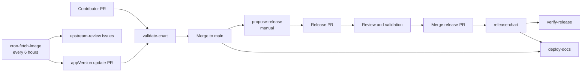

# CI / continuous validation

This repo has six GitHub Actions workflows that validate changes, publish the
documentation site, track upstream images, and release signed chart artifacts.

| Workflow | Trigger | Role |
|---|---|---|
| [validate-chart.yaml](../../.github/workflows/validate-chart.yaml) | Pull requests that change the chart, tests, validation scripts, or this workflow | Lint, generated-docs drift checks, and isolated **kind** install/test scenarios before merge. |
| [deploy-docs.yaml](../../.github/workflows/deploy-docs.yaml) | Documentation pull requests, documentation changes on `main`, manual runs, and release refreshes | Build the site with strict link checks and deploy it to GitHub Pages outside pull requests. |
| [cron-fetch-image.yaml](../../.github/workflows/cron-fetch-image.yaml) | Every 6 hours or manually | Detect a newer upstream image, open an appVersion update PR, and create upstream-review issues. |
| [propose-release.yaml](../../.github/workflows/propose-release.yaml) | Manual | Consume pending Changesets into one reviewable release PR without publishing. |
| [release-chart.yaml](../../.github/workflows/release-chart.yaml) | Push to `main` that changes `charts/hermes-agent/Chart.yaml` | Tag `vX.Y.Z`, publish OCI and Helm Repository artifacts, cosign-sign OCI, and refresh Pages. |
| [verify-release.yaml](../../.github/workflows/verify-release.yaml) | After a successful `release-chart` run | Re-verifies the **published, signed** artifact end to end. |

## How the workflows connect



The scheduled path stops at a normal pull request and review issues. It never
publishes a chart directly. Publishing starts only after a maintainer prepares,
reviews, and merges the Changesets release PR.

## validate-chart

Two jobs run on every functional change:

### `lint`

`helm lint`, `helm template`, and a **helm-docs drift check** - if
`charts/hermes-agent/README.md` is out of date relative to `README.md.gotmpl`,
the job fails. Always run `make docs` after editing `values.yaml` and commit the
result.

### `test`

Three scenarios run as a **matrix**, each on its **own ephemeral kind cluster**
(a separate runner) - fully isolated, with native per-job status, timeout, and
failure diagnostics instead of one bundled log. The PR checks list shows them
separately: `test (message)`, `test (existing-claim)`, and `test (team)`.
Scenario logic lives in [.github/scripts](../../.github/scripts) (`lib.sh` +
one script per scenario) rather than inline in the workflow.

A `changes` job skips `test` entirely for version-bump-only commits (where the
chart behavior is unchanged).

#### message scenario: [scenario-message.sh](../../.github/scripts/scenario-message.sh)

1. Install with chart-managed storage.
2. Run the chart's `hermes doctor` test hook (the same Job as `helm test`, but
   invoked directly so it can't stall on the hook watch).
3. **Only on trusted runs** (an `NVIDIA_API_KEY` secret is present): inject a
   skill onto the PVC, then do one `hermes chat` round-trip through NVIDIA NIM.

The `CI_MODELS` pool is **failover only** - the round-trip passes on the first
model that answers, not every model. The chat invocation mirrors the chart's own
test hook: `hermes chat -m <model> --provider nvidia -q <prompt> --max-turns N`.

The live Discord notification step (workflow-level, after the scenario script)
only runs for this scenario, since it's the only one with Discord enabled.

#### existingClaim scenario: [scenario-existing-claim.sh](../../.github/scripts/scenario-existing-claim.sh)

Exercises `persistence.existingClaim` (the ability to mount a pre-existing PVC
instead of one the chart creates - [PR #37](https://github.com/jyje/hermes-agent-helm/pull/37)):

1. Create a `ci-shared-pvc` PVC **outside** the chart.
2. Install with `--set persistence.existingClaim=ci-shared-pvc`.
3. Confirm the `hermes doctor` test hook passes.
4. Exec into the pod and write then read `${HERMES_HOME}/ci-claim-probe.txt`.
5. Re-run `hermes doctor`.

This is a **smoke test**: it proves the chart binds to a pre-created PVC and
starts cleanly. Persistence across restarts/upgrades remains a follow-up.

The separate `team` scenario provisions `hermes-team-knowledge` as RWX, mounts
it read-write on the leader and read-only on a member, writes a probe from the
leader, cross-reads it from the member, and confirms that a member write is
rejected. It therefore covers the multi-instance shared-knowledge boundary
without treating the volume as a task handoff path.

### Fork PRs

Fork PRs don't receive repository secrets, so the chat round-trip (and any live
Discord check) is skipped and the run falls back to **doctor-only**, which is
safe and still meaningful.

## deploy-docs

Documentation-related pull requests run `mkdocs build --strict` and upload the
site artifact, but do not deploy it. A matching change on `main`, a manual run,
or a refresh requested by `release-chart` deploys the built site through the
GitHub Pages Actions API.

The workflow merges `index.yaml` and packaged chart archives from the
`gh-pages` branch into the site output. The branch is a Helm Repository data
store; `deploy-docs` is the only workflow that publishes the Pages site.

## cron-fetch-image

The schedule `0 */6 * * *` runs at 00:00, 06:00, 12:00, and 18:00 UTC. A
manual dispatch runs the same process.

1. Fetch date-based `nousresearch/hermes-agent` tags from Docker Hub.
2. Compare the newest tag with the chart's current `appVersion`.
3. If a newer image exists, open an appVersion bump PR with a minor Changeset.
4. Independently review intervening upstream release notes with NVIDIA NIM and
   create one labeled issue for each chart-relevant follow-up.

The version bump and upstream-review jobs are independent. Maintainers can merge
the image update after its normal checks without waiting for every follow-up
issue to be implemented.

## propose-release

A maintainer starts this workflow when pending Changesets are ready. It combines
them into one release PR and synchronizes the release manifest, `Chart.yaml`,
Artifact Hub annotations, generated chart docs, and versioned examples. It does
not publish a chart.

## release-chart

Merging the release PR changes the chart version on `main` and starts this
workflow. If the version tag does not already exist, it:

1. creates the `vX.Y.Z` tag and GitHub Release;
2. packages and publishes the chart to OCI;
3. signs the OCI artifact with keyless cosign;
4. updates the Helm Repository data on `gh-pages`; and
5. triggers `deploy-docs` so the release page and repository index are served
   together.

## verify-release

After a release is published, this workflow proves the whole supply chain
against the artifact users actually pull (namespace `verify-hermes-chart`):

1. **cosign verify** the OCI artifact against this repo's Actions OIDC identity.
2. `helm install` **from the OCI registry** (not local source).
3. Run the same `hermes doctor` + chat round-trip as `validate-chart`.

A failure here means the published artifact or its signature is broken.

## Running the equivalents locally

```bash
make lint        # helm lint
make template    # render manifests
make docs        # regenerate the chart README (helm-docs) - commit the result
make test        # install + helm test (needs a cluster/kind)
```

See [Local development guide](local-development.md) for setting up a local kind cluster and a
Discord + NVIDIA dev loop.
