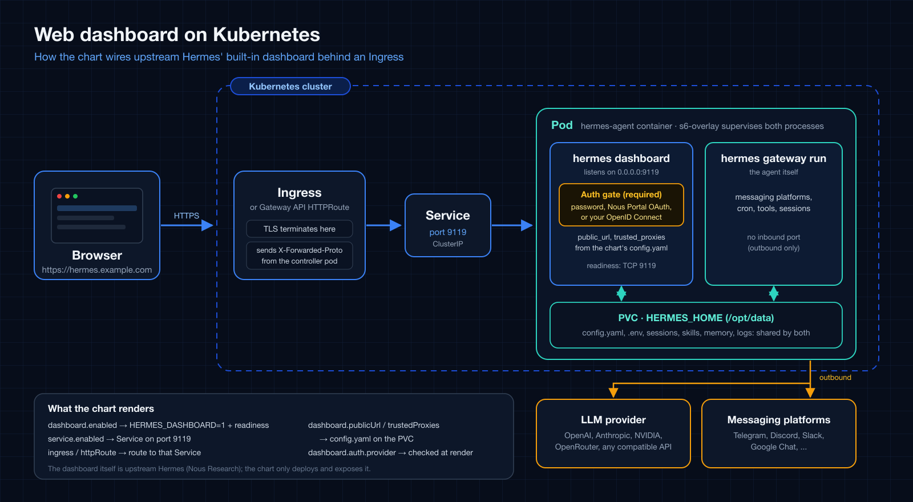

| 로그인 방식 | 필수 Secret | 오버레이 |
| --- | --- | --- |
| 사용자 이름과 비밀번호 | `OPENAI_API_KEY`, `HERMES_DASHBOARD_BASIC_AUTH_USERNAME`, `HERMES_DASHBOARD_BASIC_AUTH_PASSWORD` | `values-ingress.yaml` |
| Nous Portal OAuth | `OPENAI_API_KEY` (클라이언트 ID는 비밀이 아닙니다) | `values-ingress-oauth.yaml` |
| 자체 OpenID Connect 제공자 | `OPENAI_API_KEY` (issuer와 클라이언트 ID는 비밀이 아닙니다) | `values-ingress-oidc.yaml` |



## 언제 사용하나요?

관리 대시보드를 URL로 접근할 수 있게 하고 싶을 때 사용하세요. 대시보드는 로그인한
사람에게 API 키를 보여 주고, 로그인한 사용자는 설정 편집, shell hook 생성(업스트림
문서상 임의 명령을 실행합니다), Chat 탭(pod 안에서 도구를 쓰는 에이전트 자체) 사용도
할 수 있습니다. 로그인을 pod 셸 접근 권한으로 여기고 방식을 먼저 고르세요. non-loopback 바인드에서는
업스트림의 인증 gate가 필수라서, provider가 없으면 대시보드는 fail-closed되어 아예
리슨하지 않습니다.

| 방식 | 용도 |
| --- | --- |
| 사용자 이름과 비밀번호 | 신뢰된 네트워크나 VPN. 업스트림은 공개 인터넷 노출에는 권장하지 않습니다. |
| Nous Portal OAuth | 공개 호스트. Nous 계정으로 로그인하며, 개인 계정 클라이언트는 로그인이 소유자로 제한됩니다. |
| 자체 OpenID Connect 제공자 | 자체 identity provider를 쓰는 공개 호스트. 대시보드에는 사용자 허용 목록이 없어서 제공자가 해당 클라이언트에 토큰을 발급하는 모든 신원이 로그인할 수 있으므로, 제공자에서 애플리케이션 접근을 제한하세요. |

## 설치

`dashboard` values와 이 오버레이는 1.16.0 이후의 차트 릴리스에 있습니다.
오버레이를 하나 고릅니다.

```bash
helm upgrade --install hermes-agent ./charts/hermes-agent \
  --namespace hermes-agent --create-namespace \
  -f charts/hermes-agent/values-ingress-oidc.yaml \
  --set-string env.OPENAI_API_KEY='sk-<real>' --wait
```

비밀번호 오버레이에는
`--set-string env.HERMES_DASHBOARD_BASIC_AUTH_PASSWORD='<강한 비밀번호>'`와
`--set-string env.HERMES_DASHBOARD_BASIC_AUTH_SECRET="$(openssl rand -base64 32)"`도
필요합니다. 차트가 대시보드용 readiness probe를 렌더링하므로 `helm --wait`는 대시보드가
리슨한 뒤에 반환됩니다. 첫 시작은 번들 스킬이 볼륨에 동기화되는 동안 몇 분 걸릴 수
있습니다.

## 배포 전 조정

- **호스트와 인증서.** `ingress.hosts[0].host`, TLS 블록, cert-manager 발급자
  annotation을 설정하세요. `dashboard.publicUrl`은 첫 번째 host에서 유도되며
  (`ingress.tls`가 있으면 `https`), identity provider에 등록한 origin과 같아야 합니다.
- **Identity provider.** OAuth: Nous Portal에서 대시보드를 등록하고 **Base URL**을 외부
  origin으로 설정하세요(`/auth/callback`은 포털이 붙입니다). OIDC: 리다이렉트 URI
  `https://<host>/auth/callback`으로 public PKCE 클라이언트를 등록하고 issuer와
  클라이언트 ID를 `config.dashboard.oauth.self_hosted`에 넣으세요.
- **신뢰 프록시.** 대시보드가 peer로 보는 주소를 `dashboard.trustedProxies`에 넣으세요.
  없으면 세션 쿠키에서 `Secure`가 빠집니다. overlay CNI의 컨트롤러는 파드 네트워크
  안의 노드 터널 주소로 접근할 수 있으므로 노드 네트워크뿐 아니라 파드 네트워크도
  넣으세요.
- **나중에 바꿀 때.** `public_url`과 `trusted_proxies`는 `config.yaml`에 한 번 시드됩니다.
  이를 바꾸는 업그레이드에는 그 업그레이드에 한해 `--set bootstrap.overwrite=true`가
  필요합니다.
- **NetworkPolicy.** `networkPolicy.enabled`를 켰다면 컨트롤러가 9119 포트에 접근하도록
  허용하세요. [Egress 제한 NetworkPolicy](networkpolicy.md#ingress-뒤의-대시보드)를
  참고하세요.

전체 단계와 증상 표는 README의
[대시보드 노출하기](https://github.com/jyje/hermes-agent-helm/blob/main/charts/hermes-agent/README-ko.md#대시보드-노출하기)에
있습니다.

## 확인

세션이 없으면 `GET /`는 로그인 페이지로 리다이렉트되고 `/api/env`와 `/api/config`는
401입니다. 로그인 후 `GET /api/auth/me`가 provider를 보여 주고 세션 쿠키는 `__Host-`,
`Secure`, `HttpOnly`입니다. 업스트림은 `*.localhost` 호스트를 개발 환경으로 보고
`Secure` 쿠키를 설정하지 않으므로 그런 호스트로 테스트하지 마세요.

## 전체 오버레이

### 사용자 이름과 비밀번호

```yaml title="charts/hermes-agent/values-ingress.yaml"
--8<-- "charts/hermes-agent/values-ingress.yaml"
```

### Nous Portal OAuth

```yaml title="charts/hermes-agent/values-ingress-oauth.yaml"
--8<-- "charts/hermes-agent/values-ingress-oauth.yaml"
```

### 자체 OpenID Connect 제공자

```yaml title="charts/hermes-agent/values-ingress-oidc.yaml"
--8<-- "charts/hermes-agent/values-ingress-oidc.yaml"
```
