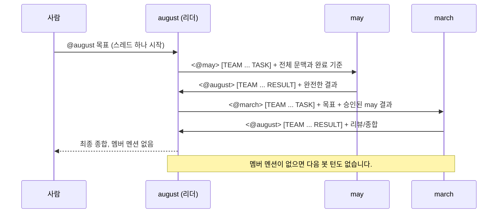

# Hermes 팀: 스케일 *업*, 그리고 그룹

[English](../../../advanced/teams/reference.md) · [한국어](reference.md)

> 한 줄 요약: **Hermes 파드를 스케일 아웃하지 마세요. 잘 관리된 단일 인스턴스를
> 여러 개 띄우고, 하나의 gateway 채널을 공유하는 팀으로 묶으세요.**

## Hermes가 단일 인스턴스인 이유

Hermes Agent는 **개인용 에이전트**입니다: 하나의 `HERMES_HOME`, 하나의
[gateway 프로세스](https://hermes-agent.nousresearch.com/docs/user-guide/messaging/),
하나의 메모리/정체성(`SOUL`, skills, `auth.json`, self-improvement 상태). gateway는
공식 문서에서 명시하듯 "설정된 모든 플랫폼에 연결되어 세션을 처리하고 cron을 실행하며
메시지를 전달하는 단일 백그라운드 프로세스"입니다 - 하나의 에이전트가 거치는 *유일한*
허브죠.

그래서 단일 인스턴스는 **단일 writer 워크로드**가 되고, 이 차트가 `replicaCount: 1`을
고정하며 스케일 아웃을 지양하는 이유입니다([차트 README](https://github.com/jyje/hermes-agent-helm/blob/main/charts/hermes-agent/README.md)의
`replicaCount` 설명 참고):

- `controller.type=deployment` → 추가 레플리카는 `Pending`에 걸립니다
  (동일한 `ReadWriteOnce` PVC를 마운트할 수 없음).
- `controller.type=statefulset` → 추가 레플리카는 각자의 PVC/정체성을 가진
  **별개의, 단절된 에이전트**가 됩니다 - 같은 에이전트의 더 큰 버전이 아닙니다.

따라서 `replicaCount`를 올려도 "같은 Hermes가 더 많아지는" 일은 없습니다. 설계상
지원되는 멀티 레플리카 모드는 없습니다.

## 모델: 경량부터 프로덕션까지

홈랩 장난감에서 프로덕션 배포로 가는 길은 **스케일 '업'하고, 그다음 그룹 만들기**입니다 - 단일
에이전트를 스케일 아웃하는 게 아닙니다:

1. **단일 인스턴스의 스팩을 키웁니다.** `resources`를 늘리고, `persistence.size`를 키우고,
   실제 `storageClass`·probe·제대로 된 시크릿 관리(SealedSecret / external-secrets)를
   붙이세요. 하나의 인스턴스를, 잘.
2. **여러 인스턴스를 팀으로 묶습니다.** 한 에이전트로 부족할 때(사람이 늘고, 역할이
   늘고, 병렬 작업이 늘 때) *여러* 단일 인스턴스를 - 각각 독립 릴리즈로 - 배포하고,
   **하나의 공유 gateway 채널**에 합류시켜 에이전트와 팀이 공통 컨텍스트 버스를
   공유하게 합니다.

이 문서는 2번에 대한 이야기입니다.

## 팀이 컨텍스트를 공유하는 방식

각 Hermes 인스턴스는 자신의 gateway를 **같은 채널**(예: 하나의 Discord 채널)에
연결합니다. 그 공유 채널이 팀의 컨텍스트 버스가 됩니다:

- 각 에이전트가 채널에서 메시지를 읽고 쓰므로, **대화 자체가** 사람이든 에이전트든
  모든 구성원이 보는 **공유 컨텍스트**가 됩니다.
- 그 채널은 동시에 **home 채널**(`*_HOME_CHANNEL`) 역할을 합니다: 각 에이전트가
  cron 결과와 능동적 알림을 전달하는 곳이며,
  [messaging gateway 문서](https://hermes-agent.nousresearch.com/docs/user-guide/messaging/)에
  설명돼 있습니다.
- 팀 전체가 공유해야 할 지식(기술 스택, 컨벤션, 우선순위)은 **컨텍스트 파일**
  (`SOUL.md`, `AGENTS.md`)로 고정합니다 - 매 세션의 시스템 프롬프트에 주입되며,
  [Team Telegram Assistant 가이드](https://hermes-agent.nousresearch.com/docs/guides/team-telegram-assistant)에
  나옵니다.
- **공유 영속적 지식**(벡터 인덱스나 공유 참고 파일)을 위해 각자의 사설
  `HERMES_HOME`은 유지하고, `extraVolumes`와 `extraVolumeMounts`로 별도 경로에
  **같은 ReadWriteMany(RWX) PVC**를 마운트할 수 있습니다. 이렇게 하면 config,
  메모리, 정체성, gateway 세션을 공유하지 않고 공통 지식 베이스를 읽고 쓸 수
  있습니다. 완전한 예는
  [`values-shared-knowledge.yaml`](https://github.com/jyje/hermes-agent-helm/blob/main/charts/hermes-agent/values-shared-knowledge.yaml)을
  참조하세요. **주의:** PVC는 `ReadWriteMany` 액세스 모드를 지원하는 StorageClass를
  사용해야 합니다(예: NFS, CephFS, Longhorn); 대부분의 클라우드 제공자의 기본
  StorageClass는 `ReadWriteOnce`이므로 다중 작성자는 동작하지 않습니다.

> **솔직한 현황(업스트림).** 하나의 그룹 안에서 에이전트끼리 직접 인지하는 기능은
> Hermes 자체에서 아직 발전 중입니다(업스트림 이슈
> [#10965](https://github.com/NousResearch/hermes-agent/issues/10965),
> [#14853](https://github.com/NousResearch/hermes-agent/issues/14853) 참고). 현재
> 신뢰할 수 있는 팀 패턴은 **공유 채널에 사람 + 역할별 에이전트 한둘**을 두고 각
> 에이전트를 `@mention`으로 부르는 것입니다. 채널을 단일 진실 공급원으로 삼으세요;
> 더 풍부한 에이전트 간 컨텍스트 주입은 업스트림 로드맵에 있습니다.

## Discord로 Hermes 팀 만들기

하나의 Discord 채널에 두 에이전트로 구성한 구체적 예시입니다.

### 1. 에이전트마다 봇 1개, 공유 채널 1개

원하는 에이전트마다
[Discord Developer Portal](https://discord.com/developers/applications)에서 봇을
만들고 **Message Content Intent**를 켠 뒤, **모두**를 **같은 서버·같은 채널**에
초대하세요. 그 채널 ID를 메모해 두면 공유 `DISCORD_HOME_CHANNEL`이 되고, 팀원들의
Discord 사용자 ID를 모아 `DISCORD_ALLOWED_USERS`로 씁니다.

### 2. 봇마다 인스턴스 1개, 같은 채널로

각 에이전트를 **독립 릴리즈**로 배포하되, **각자의 `DISCORD_BOT_TOKEN`**을 쓰고
**`DISCORD_HOME_CHANNEL`과 `DISCORD_ALLOWED_USERS`는 동일하게** 둡니다. 순수 Helm으로는
두 설치를 나란히 실행합니다:

```bash
# 에이전트 A: "planner"
helm upgrade --install hermes-planner ./charts/hermes-agent \
  --namespace hermes-team --create-namespace \
  -f charts/hermes-agent/values-anthropic-and-discord.yaml \
  --set-string env.ANTHROPIC_API_KEY='sk-ant-...' \
  --set-string env.DISCORD_BOT_TOKEN='<planner-bot-token>' \
  --set-string extraEnv[0].name=DISCORD_HOME_CHANNEL \
  --set-string extraEnv[0].value='<shared-channel-id>' --wait

# 에이전트 B: "builder" (같은 채널, 다른 봇 토큰)
helm upgrade --install hermes-builder ./charts/hermes-agent \
  --namespace hermes-team --create-namespace \
  -f charts/hermes-agent/values-anthropic-and-discord.yaml \
  --set-string env.ANTHROPIC_API_KEY='sk-ant-...' \
  --set-string env.DISCORD_BOT_TOKEN='<builder-bot-token>' \
  --set-string extraEnv[0].name=DISCORD_HOME_CHANNEL \
  --set-string extraEnv[0].value='<shared-channel-id>' --wait
```

릴리즈 이름을 다르게(`hermes-planner`, `hermes-builder`) 두면 모든 리소스가 분리됩니다.
각 에이전트가 자신의 파드·PVC·정체성을 가지므로, 채널만 공유할 뿐 진짜로 독립적인 단일
인스턴스들이 됩니다.

### 3. 또는 ArgoCD ApplicationSet으로 팀을 생성하기 (권장)

1~2단계는 멤버가 몇 명을 넘어가면 확장되지 않습니다 - 에이전트마다 Application/설치를
하나씩 두면, 명부가 바뀔 때마다 파일을 손으로 고쳐야 합니다.
[ApplicationSet](https://argo-cd.readthedocs.io/en/stable/operator-manual/applicationset/)은
명부를 **데이터**로, 에이전트당 Application을 **템플릿**으로 바꿉니다:

```yaml
apiVersion: argoproj.io/v1alpha1
kind: ApplicationSet
metadata:
  name: hermes-team
  namespace: argocd
spec:
  generators:
    - list:
        elements:
          - name: planner
            botTokenSecret: hermes-planner-discord-secrets
          - name: builder
            botTokenSecret: hermes-builder-discord-secrets
          # 팀원 추가 = 리스트 항목 추가
  template:
    metadata:
      name: 'hermes-{{name}}'
    spec:
      project: default
      source:
        repoURL: ghcr.io/jyje/hermes-agent-helm
        chart: hermes-agent
        targetRevision: '*'   # 릴리즈된 차트 버전으로 고정
        helm:
          releaseName: 'hermes-{{name}}'
          valuesObject:
            env:
              ANTHROPIC_API_KEY: sk-ant-REPLACE_ME
            extraEnvFrom:
              - secretRef:
                  name: '{{botTokenSecret}}'   # 멤버별 시크릿, 별도 생성
            extraEnv:
              - name: DISCORD_HOME_CHANNEL     # 팀 전체 공유
                value: "<shared-channel-id>"
              - name: DISCORD_ALLOWED_USERS    # 팀 전체 공유
                value: "<comma-separated-ids>"
      destination:
        server: https://kubernetes.default.svc
        namespace: hermes-team
      syncPolicy:
        syncOptions:
          - CreateNamespace=true
```

이렇게 하면 [examples/argocd/](../../../examples/argocd/)와
["Multiple instances in the same namespace"](https://github.com/jyje/hermes-agent-helm/blob/main/examples/argocd/README.md#multiple-instances-in-the-same-namespace)
섹션의 `fullname` 유일성 규칙을 그대로 따르면서, 다음을 거의 공짜로 얻습니다:

- **명부가 한 곳**(`generators[0].list.elements`)**에 존재**: N개의 Application
  파일이 아니라. 팀원 추가는 한 줄짜리 diff입니다.
- **공유 필드**(`DISCORD_HOME_CHANNEL`, `DISCORD_ALLOWED_USERS`)는 `template`에
  한 번만 두고, **멤버별 필드**(이름, 시크릿 참조, 역할)는 리스트에서 옵니다.
  차트 자체의 공유/인스턴스별 분리(`env`/`extraEnvFrom`은 릴리즈별, `extraEnv`는
  template으로 공유)와 같은 모양입니다.
- **멤버별 유일한 `fullname`**은 `releaseName`의 `{{name}}` 치환에서 자동으로
  나옵니다.

렌더링된 형태를 명시적으로 보고 싶다면(예: 리뷰용, 또는 ApplicationSet 없이),
[examples/argocd/](../../../examples/argocd/)에 제공자/예제별로 손으로 작성한 Application이
하나씩 있습니다 - 팀원마다 복사해서 쓸 수 있고, 위 ApplicationSet은 같은 모양을
생성하는 것뿐입니다.

### 4. (선택) 각 에이전트에 역할 부여

각 인스턴스는 자신의 `config`와 personality를 가지므로, 한 에이전트를 복제하기보다
상호 보완적인 역할(예: planner vs. builder)로 범위를 나누세요. 모두가 공유해야 할
팀 지식은 각 인스턴스의 `HERMES_HOME`에 심는 컨텍스트 파일(`SOUL.md` / `AGENTS.md`)에
둡니다.

> **다음 단계(탐색적).** 위 ApplicationSet은 팀의 릴리즈를 선언적으로
> **템플릿화**하는 부분을 커버하며, 이게 "팀"에 필요한 것의 대부분입니다.
> 전용 오퍼레이터(`Agent` / `AgentTeam` CRD, 별도 레포)는 이 템플릿 전용 모델이
> 실제로 부족해질 때만 가치가 있습니다 - 예를 들어:
>
> - **팀 전체 상태를 보여주는 단일 오브젝트**(`kubectl get agentteam my-team` →
>   "3/4 멤버 healthy")가 필요한데, ApplicationSet은 이를 집계해주지 않을 때;
> - **팀 단위 불변식의 admission-time 검증**(예: "모든 멤버는 동일한
>   `DISCORD_HOME_CHANNEL`을 공유해야 한다")이 필요한데, 템플릿으로는 강제할 수
>   없을 때;
> - **능동적 reconcile/상태 기계**(예: 멤버 장애 시 역할 재배정)가 필요한데,
>   템플릿이 표현할 수 있는 범위를 넘어설 때.
>
> 이 중 하나가 실제로, 관찰된 필요가 되기 전까지는 위 ApplicationSet 패턴이
> 권장 접근입니다. [로드맵](../../about/roadmap.md)과
> [`charts/hermes-operator/`](../../../charts/hermes-operator/) 플레이스홀더를
> 참고하세요.

## 리더 주도 팀 (Leader-orchestrated teams)

위의 채널 공유 팀은 *플랫(flat)*하여 모든 에이전트가 답할 수 있습니다.
**리더 주도 팀**은 하나의 보이는 Discord 스레드를 유지하되 대화 그래프를
스타 형태로 제한합니다(데모 명부: 리더 `august`, 멤버 `may`, `march`):

- **사람과는 리더만 대화합니다.** 멤버는 `august`가 메시지 본문에서 명시적으로
  멘션했을 때만 동작하고, 완전한 결과를 본문에 담아 `august`를 명시적으로
  멘션해 돌려줍니다.
- **Discord 스레드가 컨텍스트 버스이자 감사 로그입니다.** 위임, 중간 결과,
  리뷰 피드백, 수정, 최종 종합이 모두 스레드 메시지로 남습니다. 파일 경로는
  핸드오프가 될 수 없습니다.
- **모든 발신자가 하나의 대화 기록을 씁니다.** 모든 팀 values 파일은
  `group_sessions_per_user: false`를 설정합니다. 그렇지 않으면 Hermes 기본값이
  같은 스레드의 사람, `may`, `march`를 서로 다른 세션으로 분리합니다.
  `discord.history_backfill: true`는 봇이 호출되지 않았던 동안의 보이는 스레드
  메시지를 문맥으로 보충합니다.
- **mention-only 루프 브레이크를 그대로 적용합니다.**
  `DISCORD_ALLOW_BOTS=mentions`, `DISCORD_THREAD_REQUIRE_MENTION=true`,
  reply-reference 끄기, replied-user 멘션 끄기를 함께 써서 메시지 본문의 실제
  `<@BOT_ID>`만 다음 봇 턴을 시작하게 합니다.

> **실험적 / upstream 미지원:** Hermes 공식 Discord 가이드는 봇 대 봇 대화에
> 내장 circuit breaker가 없으며 지원 토폴로지가 아니라고 명시합니다. 이 레시피는
> 한 번에 하나의 본문 멘션, reply-reference ping 차단, 프롬프트 수준의 최대 6회
> 핸드오프, 마지막 멤버 멘션 제거로 위험을 좁힙니다. 이는 완화책이지 upstream
> 지원 보장이 아닙니다. 전용 신뢰 채널에서 시험하고 필요하면 즉시 봇을 중지하거나
> scale down할 준비를 하세요.

각 인스턴스에는 설정과 자체 gateway 세션 캐시를 위한 일반 사설
`HERMES_HOME` PVC가 남습니다. 이 PVC들은 공유되지 않으며 에이전트 사이에서
과제나 결과를 운반하지 않습니다. 일부 local-path provisioner가 PVC 루트를
`root:root 0700`으로 만들기 때문에, 예시는 작은 init container로 이 사설 홈의
소유권을 uid/gid 10000에 줍니다. 진실의 원천은 Discord입니다.

로컬 기능과 팀 조정은 별개입니다. 에이전트가 자체 작업에 사설 임시 파일과 영속
메모리를 사용할 수 있도록 `file`과 `memory` toolset은 활성 상태로 둡니다. 다른
에이전트에게 그 사설 상태를 읽으라고 지시해서는 안 되며, hook, watcher, scheduler,
백그라운드 프로세스, 파일 쓰기, 메모리 업데이트, tool/API 호출로 팀 과제를
전달하거나 트리거해서도 안 됩니다. 정확한 봇 멘션과 완전한 과제 또는 결과 계약을
포함한 공개 Discord 메시지만 핸드오프입니다.

별도로 미리 준비한 `hermes-team-knowledge` RWX PVC를
`/opt/data/team-knowledge`에 마운트합니다. 리더는 읽기/쓰기로 마운트하며 유일한
큐레이터이고, 멤버는 읽기 전용으로 마운트합니다. 여기에는 영속적이고 재사용 가능한
지식만 두며 실시간 조정 상태는 두지 않습니다. 권한 경계가 프롬프트 계약을 보강하고
다중 writer 경합을 피합니다.

기준 프로토콜은 의도적으로 직렬입니다. 리더가 멤버 한 명을 멘션하고, 그 멤버가
리더를 다시 멘션할 때까지 기다린 뒤 결과를 검토하고 다음 멤버를 멘션합니다.
방 전체가 하나의 세션을 쓰는 상태에서 여러 멤버가 동시에 답하면 하나의 실행 슬롯을
두고 경합할 수 있으므로, 직렬화가 첫 실증을 결정적으로 만듭니다.



모든 위임에는 작은 공개 계약을 넣습니다:

```text
<@MEMBER_ID>

Context: <승인된 이전 결과를 포함해 필요한 모든 문맥>
Task: <구체적인 과제 하나>
Done when: <관찰 가능한 완료 기준>
Reply contract: <@LEADER_ID>를 멘션하고 완전한 결과를 여기에 포함.

[TEAM run=<short-id> step=<n> TASK]
```

의도한 봇이 분명히 호출되도록 멘션은 첫 줄에 두고, TEAM 메타데이터는 과제 본문을
방해하지 않도록 마지막 독립 줄에 둡니다.

먼저 RWX를 지원하는 StorageClass로 공유 지식 claim을 만듭니다. 루트는 uid/gid
10000이 읽을 수 있어야 하고 리더의 uid/gid 10000이 쓸 수 있어야 합니다:

```yaml
apiVersion: v1
kind: PersistentVolumeClaim
metadata:
  name: hermes-team-knowledge
  namespace: hermes-team
spec:
  accessModes: [ReadWriteMany]
  storageClassName: nfs-client # 사용하는 RWX 지원 클래스로 교체
  resources:
    requests:
      storage: 10Gi
```

그다음 리더와 멤버별 릴리스를 배포합니다. values 파일은 각 에이전트의 사설 홈과
별개로 동일한 claim을 마운트합니다:

```bash
helm upgrade --install hermes-august ./charts/hermes-agent \
  --namespace hermes-team --create-namespace \
  -f charts/hermes-agent/values-team-leader.yaml \
  --set-string env.NVIDIA_API_KEY='nvapi-<real>' \
  --set-string env.DISCORD_BOT_TOKEN='<august-bot-token>' --wait

helm upgrade --install hermes-may ./charts/hermes-agent \
  --namespace hermes-team \
  -f charts/hermes-agent/values-team-member.yaml \
  --set-string env.NVIDIA_API_KEY='nvapi-<real>' \
  --set-string env.DISCORD_BOT_TOKEN='<may-bot-token>' --wait

# march도 반복합니다. 이 인덱스는 멤버 예시의 TEAM_MEMBER_NAME입니다.
helm upgrade --install hermes-march ./charts/hermes-agent \
  --namespace hermes-team \
  -f charts/hermes-agent/values-team-member.yaml \
  --set-string fullnameOverride=hermes-march \
  --set-string 'extraEnv[6].value=march' \
  --set-string env.NVIDIA_API_KEY='nvapi-<real>' \
  --set-string env.DISCORD_BOT_TOKEN='<march-bot-token>' --wait
```

values 파일의 채널 ID, 허용할 사람 ID, 봇 ID도 교체해야 합니다. 선언형 사용자는
[`examples/argocd/hermes-team.yaml`](https://github.com/jyje/hermes-agent-helm/blob/main/examples/argocd/hermes-team.yaml)을
사용할 수 있습니다. 리더 Application 하나와 멤버 ApplicationSet으로 구성됩니다.
이 Application들이 sync되기 전에 대상 네임스페이스에 공유 claim을 준비하세요.

### 라이브 증거

2026-07-30(KST), kind의 고정 이미지 `v2026.7.20`에서 스레드 기반 실행 두 건을
실제로 검증했습니다. 두 실행 모두 사람 → `august` → `may` → `august` → `march`
→ `august` → 사람 순서로 진행됐습니다:

| 실행 | 목표와 결과 | 소요 시간 | 증거 |
| --- | --- | ---: | --- |
| `verify-sum` | `7 + 11 = 18`; `may`가 계산하고 `march`가 독립 검증한 뒤 `august`가 종합 | 약 105초 | [Discord 스레드](https://discord.com/channels/1515526710353858631/1532150987123458088) |
| `verify-sum-01` | `111237 + 7256311 = 7,367,548`; 계산과 자리별 덧셈 검증이 일치 | 약 96초 | [Discord 스레드](https://discord.com/channels/1515526710353858631/1532155035495043172) |

두 번째 실행은 개선된 표시 계약도 증명합니다. 봇 멘션은 첫 줄에 있고
`[TEAM run=… step=… TASK|RESULT]`는 마지막 독립 줄에 표시됐습니다. ID를 가린
Discord API read-back으로 작성자/타임스탬프 순서를 확인했고, 완전한 결과가
스레드에 남았으며 두 최종 리더 메시지 모두 멤버 멘션이 없었습니다. 세 파드에는
`/opt/data/team` 경로가 없어서 공유 파일 핸드오프 자체가 불가능했습니다. 기존
두 대화 실행은 전용 지식 마운트를 추가하기 전에 수행했으므로 메시지 프로토콜을
증명하지만 공유 스토리지를 증명하지는 않습니다. 현재 kind 구조 시나리오는 별도로
리더가 지식 PVC에 쓰고 멤버가 같은 내용을 읽으며 멤버의 쓰기는 거부되는 것을
검증합니다. 기존 kind 스크린샷은 독립 릴리스 세 개와 사설 홈을 따로 증명합니다.

위 라이브 증거는 **Discord 전용**입니다. Discord 스레드, 멘션,
reply-reference, 세션 의미론에 의존하며, 실제 멀티 봇 실증을 거친 플랫폼도
Discord뿐입니다. Telegram과 Slack에도 모든 루프 브레이크 노브의 실제
대응물이 설정 레벨에서 확인되지만(아래 참조), 아직 리더 팀 라이브 실행이
뒷받침하지는 않습니다. 이어지는 레시피는 근거 있는 출발점으로 보시되,
무인 운영에 맡기기 전에는 플랫폼 차원의 자체 실증이 필요합니다.

### Telegram과 Slack

스타 토폴로지 프로토콜 자체는 플랫폼을 가리지 않습니다. 리더만 사람과 대화하고,
멤버는 명시적 멘션에만 응답하고, `[TEAM run=<id> step=<n> TASK|RESULT]` 메타데이터
계약 아래 한 번에 한 명씩 직렬로 핸드오프합니다. 여기에 Discord API 표면을 타는
부분은 하나도 없습니다. 플랫폼마다 달라지는 건 **멘션을 쓰는 방법**과 **루프를
닫는 환경변수**뿐입니다. Discord/Telegram/Slack 전체 비교는
[collaboration-ko.md § 노브 대응표](collaboration-ko.md#노브-대응표)에 있으니,
여기서는 리더 팀에 필요한 핵심만 정리합니다.

**Telegram.** 봇은 숫자 ID가 아니라 `@username`으로 부릅니다(`bot`으로 끝나야
합니다). 리더의 `environment_hint`에는 멤버 전원의 정확한 `@username`을, 각
멤버의 hint에는 리더의 `@username`을 넣으세요. `values-team-leader.yaml` /
`values-team-member.yaml`의 `environment_hint` 문안은 그대로 재사용하되,
`<@ID>` 토큰을 모두 `@bot_username`으로 바꾸고 Discord에는 없던 지시를 한 줄
덧붙이세요. 팀원을 부를 때 Telegram의 native "reply" 기능을 절대 쓰지 말라는
지시입니다. reply는 이 프로토콜이 기대는 명시적 멘션 신호가 아니기 때문입니다.
그래서 위임 계약은 이런 형태가 됩니다:

```text
@may_bot

Context: <everything needed, including accepted earlier results>
Task: <one concrete task>
Done when: <observable acceptance criteria>
Reply contract: mention @august_bot and include the complete result here.

[TEAM run=<short-id> step=<n> TASK]
```

리더의 `extraEnv` 루프 브레이크 블록은 Telegram 노브로 갈아 끼우세요
(`TELEGRAM_ALLOW_BOTS=mentions`, `TELEGRAM_REQUIRE_MENTION=true`,
`TELEGRAM_REPLY_TO_MODE=off`). `TELEGRAM_HOME_CHANNEL` /
`TELEGRAM_ALLOWED_USERS`에는 공유 그룹 채팅과 신뢰하는 사람 ID를 넣습니다.
`values-openai-and-telegram.yaml`과 같은 모양입니다.
`TELEGRAM_EXCLUSIVE_BOT_MENTIONS`는 기본값 `true`로 두실 만합니다. 봇 username
하나를 콕 집어 지목한 메시지는 그룹의 다른 봇들이 통째로 무시하므로, 형제 멤버에게
간 위임을 엉뚱한 멤버가 집어 드는 사고를 막아 주는 독립적인 2차 방어가 됩니다.

**Slack.** 멘션이 Discord와 똑같은 `<@USER_ID>` 마크업이라, 위임 계약도
`environment_hint`도 그대로 옮겨 쓸 수 있습니다. Discord user ID를 Slack
member ID로 바꾸기만 하면 됩니다. 가장 중요한 노브는
`SLACK_STRICT_MENTION=true`입니다. Slack은 기본적으로 봇이 한 번 멘션된
스레드를 기억해서, 그다음부터는 멘션이 없어도 그 스레드 내내 계속
반응합니다(업스트림 소스 주석도 이 설정을 끄면 "agent-to-agent ack loop"가
다시 열린다고 직접 밝힙니다). 리더와 멤버 전원의 루프 브레이크 블록을
`SLACK_ALLOW_BOTS=mentions`, `SLACK_REQUIRE_MENTION=true`,
`SLACK_STRICT_MENTION=true`로 두고, `SLACK_HOME_CHANNEL` /
`SLACK_ALLOWED_USERS`에는 공유 채널과 신뢰하는 사람을 지정하세요.

`group_sessions_per_user: false` 관리는 두 플랫폼에서도 Discord 레시피와
똑같습니다. Telegram과 Slack 역시 기본값으로는 발신자별로 세션을 나누기 때문에,
공유 트랜스크립트 설정은 플랫폼을 가리지 않고
`config.group_sessions_per_user: false`로 유지합니다. 공유 지식 PVC,
`disabled_toolsets`, 6단계 핸드오프 상한, `values-team-leader.yaml` /
`values-team-member.yaml`의 "hook·파일·메모리로 핸드오프하지 말 것" 규칙도 전부
그대로 적용됩니다. 달라지는 건 플랫폼 블록(`env`/`extraEnv`)과
`environment_hint`의 멘션 토큰 형식뿐입니다.

### 공유 지식과 조정은 분리합니다

리더는 승인된 재사용 지식을 `/opt/data/team-knowledge` 아래에 큐레이션할 수 있고,
멤버는 이를 배경 지식으로 참고할 수 있습니다. 공유 PVC에는 실행별 과제, 담당자,
queue, 상태, 중간 결과, 완료 마커, 다음 단계 지시를 두면 안 됩니다. 멤버는 파일
변경을 polling해서는 안 되며 모든 위임은 Discord 메시지만으로 완전히 이해할 수
있어야 합니다. 결과도 경로만 가리키지 말고 관련 근거 전체를 스레드에 다시 담아야
합니다. 이렇게 해야 영속 지식을 활용하면서 숨은 조정 플레인으로 변질되지 않습니다.

## 함께 보기

- [Hermes 협업](collaboration.md) - 다음 단계: 묶인 에이전트들이
  `@mention`으로 핸드오프하고 무한루프를 멈추게 하기(봇 대 봇 레시피).
- [차트 README](https://github.com/jyje/hermes-agent-helm/blob/main/charts/hermes-agent/README.md): 전체 값 테이블,
  `replicaCount` 단일 writer 근거, Discord/Telegram 환경변수.
- [로드맵](../../about/roadmap.md): ApplicationSet 기반 팀 패턴, 그리고
  `hermes-operator`(`Agent` / `AgentTeam` CRD)가 정당화되는 조건.
- [examples/argocd/](../../../examples/argocd/): 에이전트당 Application 1개, 네임스페이스당
  다중 인스턴스, SealedSecret 시크릿 연결.
- Hermes 공식 문서:
  [Messaging gateway](https://hermes-agent.nousresearch.com/docs/user-guide/messaging/)
  ·
  [Team Telegram Assistant](https://hermes-agent.nousresearch.com/docs/guides/team-telegram-assistant)
