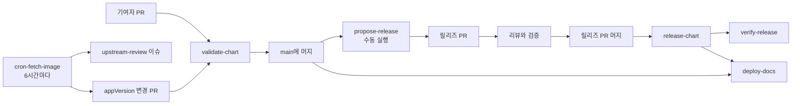

# CI / 지속적 검증

이 저장소에는 여섯 개의 GitHub Actions workflow가 있어 변경사항을 검증하고,
문서 사이트를 게시하며, upstream 이미지를 추적하고, 서명된 차트 아티팩트를
릴리즈합니다.

| Workflow | 트리거 | 역할 |
|---|---|---|
| [validate-chart.yaml](../../../.github/workflows/validate-chart.yaml) | 차트, 테스트, 검증 스크립트 또는 이 workflow를 변경하는 pull request | 머지 전 lint, 생성 문서 드리프트 확인, 격리된 **kind** 설치/테스트 시나리오 |
| [deploy-docs.yaml](../../../.github/workflows/deploy-docs.yaml) | 사이트가 렌더링하는 대상(`docs/`, 각 README, `charts/`, `examples/`, `mkdocs.yml` 등)을 건드리는 pull request와 `main` push, 수동 실행, 릴리즈 갱신 | 엄격한 링크 검사로 사이트를 빌드하고 pull request 외 실행에서 GitHub Pages에 배포 |
| [cron-fetch-image.yaml](../../../.github/workflows/cron-fetch-image.yaml) | 6시간마다 또는 수동 실행 | 새 upstream 이미지를 감지하고 appVersion 변경 PR과 upstream-review 이슈 생성 |
| [propose-release.yaml](../../../.github/workflows/propose-release.yaml) | 수동 실행 | 게시하지 않고 대기 중인 Changeset을 검토 가능한 릴리즈 PR 하나로 변환 |
| [release-chart.yaml](../../../.github/workflows/release-chart.yaml) | `charts/hermes-agent/Chart.yaml`을 바꾸는 `main` push | `vX.Y.Z` 태그 생성, OCI와 Helm Repository 게시, OCI cosign 서명 및 Pages 갱신 |
| [verify-release.yaml](../../../.github/workflows/verify-release.yaml) | `release-chart` 성공 이후 | **게시되어 서명된** 아티팩트를 처음부터 끝까지 다시 검증 |

## workflow 연결 구조



예약 실행 경로는 일반 pull request와 검토 이슈를 만드는 데서 멈춥니다. 차트를
직접 게시하지 않습니다. 메인테이너가 Changesets 릴리즈 PR을 준비하고 검토한 뒤
머지해야 게시가 시작됩니다.

## validate-chart

기능적 변경마다 job 두 개가 실행됩니다:

### `lint`

`helm lint`, `helm template`, 그리고 **helm-docs 드리프트 체크** - `charts/hermes-agent/README.md`가
`README.md.gotmpl` 대비 오래됐으면 job이 실패합니다. `values.yaml`을 수정한
뒤에는 항상 `make docs`를 실행하고 결과를 커밋하세요.

### `test`

시나리오 세 개가 **매트릭스**로 실행되며, 각각 **독립된 임시 kind
클러스터**(별도 러너)에서 돕니다 - 완전히 격리되어 있고, 하나로 뭉친 로그
대신 job별로 고유한 상태·타임아웃·실패 진단을 갖습니다. PR 체크 목록에는
`test (message)`, `test (existing-claim)`, `test (team)`으로 따로
표시됩니다. 시나리오 로직은 workflow에 인라인으로 있지 않고
[.github/scripts](../../../.github/scripts)(`lib.sh` + 시나리오별 스크립트)에
있습니다.

`changes` job은 버전 범프만 있는(차트 동작이 바뀌지 않는) 커밋에는 `test`
자체를 건너뜁니다.

#### message 시나리오: [scenario-message.sh](../../../.github/scripts/scenario-message.sh)

1. 차트가 관리하는 스토리지로 설치.
2. 차트의 `hermes doctor` 테스트 훅을 실행(`helm test`와 같은 Job이지만,
   hook watch에서 멈추지 않도록 직접 호출).
3. **신뢰된 실행에서만**(`NVIDIA_API_KEY` 시크릿이 있을 때): PVC에 skill을
   주입한 뒤, NVIDIA NIM을 통한 `hermes chat` 라운드트립을 한 번 실행.

`CI_MODELS` 풀은 **failover 전용**입니다 - 라운드트립은 모든 모델이 아니라
먼저 응답한 모델에서 통과합니다. chat 호출은 차트 자체의 테스트 훅을
그대로 반영합니다: `hermes chat -m <model> --provider nvidia -q <prompt> --max-turns N`.

라이브 Discord 알림 단계(workflow 레벨, 시나리오 스크립트 이후)는 이
시나리오에서만 실행됩니다 - Discord가 켜져 있는 유일한 시나리오이기
때문입니다.

#### existingClaim 시나리오: [scenario-existing-claim.sh](../../../.github/scripts/scenario-existing-claim.sh)

`persistence.existingClaim`(차트가 만드는 대신 이미 존재하는 PVC를 마운트하는
기능 - [PR #37](https://github.com/jyje/hermes-agent-helm/pull/37))을
검증합니다:

1. 차트 **바깥에서** `ci-shared-pvc` PVC 생성.
2. `--set persistence.existingClaim=ci-shared-pvc`로 설치.
3. `hermes doctor` 테스트 훅 통과 확인.
4. 파드에 exec로 들어가 `${HERMES_HOME}/ci-claim-probe.txt`를 쓰고 읽기.
5. `hermes doctor` 재실행.

이건 **스모크 테스트**입니다: 차트가 미리 만들어진 PVC에 바인딩되어 깨끗하게
시작함을 증명합니다. 재시작/업그레이드 사이의 영속성은 후속 과제로
남아 있습니다.

별도의 `team` 시나리오는 `hermes-team-knowledge`를 RWX로 준비해 리더에는
읽기/쓰기로, 멤버에는 읽기 전용으로 마운트하고, 리더가 프로브를 쓰고
멤버가 이를 교차로 읽은 뒤, 멤버의 쓰기가 거부되는지 확인합니다. 이렇게
멀티 인스턴스 공유 지식의 경계를 검증하되, 이 볼륨을 작업 핸드오프
경로로 취급하지는 않습니다.

### Fork PR

Fork PR은 저장소 시크릿을 받지 못하므로, chat 라운드트립(그리고 라이브
Discord 체크)은 건너뛰고 **doctor 전용**으로 폴백합니다 - 안전하면서도
여전히 의미 있는 검증입니다.

## deploy-docs

이 workflow의 경로 필터는 `docs/`보다 넓게, 사이트가 렌더링하는 대상 전부를
포함합니다. 루트와 차트의 README, `charts/`, `examples/`, `mkdocs.yml`,
`main.py`, `requirements.txt`가 모두 해당합니다. 차트만 바꾼 pull request도
이 workflow를 실행하는데, 차트 README가 사이트의 일부이기 때문입니다.

pull request는 `mkdocs build --strict`를 실행하고 사이트 아티팩트를
업로드하지만 배포하지는 않습니다. 같은 변경이 `main`에 머지되거나, 수동
실행하거나, `release-chart`가 갱신을 요청하면 GitHub Pages Actions API를 통해
빌드된 사이트를 배포합니다.

이 workflow는 `gh-pages` 브랜치의 `index.yaml`과 패키징된 차트 아카이브를
사이트 출력에 병합합니다. 이 브랜치는 Helm Repository 데이터 저장소이고,
`deploy-docs`만 Pages 사이트를 게시합니다.

## cron-fetch-image

`0 */6 * * *` 스케줄은 UTC 기준 00:00, 06:00, 12:00, 18:00에 실행됩니다.
수동 실행도 같은 절차를 따릅니다.

1. Docker Hub에서 날짜 기반 `nousresearch/hermes-agent` 태그를 가져옵니다.
2. 최신 태그를 차트의 현재 `appVersion`과 비교합니다.
3. 새 이미지가 있으면 minor Changeset을 포함한 appVersion 변경 PR을 만듭니다.
4. 독립적으로 NVIDIA NIM이 그 사이의 upstream 릴리즈 노트를 검토하고,
   차트와 관련된 후속 작업마다 레이블이 있는 이슈를 하나씩 만듭니다.

버전 변경과 upstream-review job은 서로 독립적입니다. 메인테이너는 모든 후속
이슈의 구현을 기다리지 않고 일반 검증을 통과한 이미지 변경을 머지할 수 있습니다.

## propose-release

대기 중인 Changeset이 릴리즈 준비를 마치면 메인테이너가 이 workflow를
실행합니다. 하나의 릴리즈 PR로 결합하고 릴리즈 manifest, `Chart.yaml`,
Artifact Hub 어노테이션, 생성된 차트 문서, 버전이 포함된 예제를 동기화합니다.
차트를 게시하지는 않습니다.

## release-chart

릴리즈 PR을 머지하면 `main`의 차트 버전이 바뀌고 이 workflow가 시작됩니다.
해당 버전 태그가 아직 없다면 다음 작업을 수행합니다.

1. `vX.Y.Z` 태그와 GitHub Release를 생성합니다.
2. 차트를 패키징해 OCI에 게시합니다.
3. keyless cosign으로 OCI 아티팩트에 서명합니다.
4. `gh-pages`의 Helm Repository 데이터를 갱신합니다.
5. 릴리즈 페이지와 저장소 인덱스를 함께 제공하도록 `deploy-docs`를 실행합니다.

## verify-release

릴리즈가 게시된 뒤, 이 workflow는 사용자가 실제로 pull하는 아티팩트를
기준으로 전체 공급망을 증명합니다(네임스페이스 `verify-hermes-chart`):

1. 이 저장소의 Actions OIDC 아이덴티티로 OCI 아티팩트를 **cosign verify**.
2. (로컬 소스가 아니라) **OCI 레지스트리에서** `helm install`.
3. `validate-chart`와 같은 `hermes doctor` + chat 라운드트립 실행.

여기서 실패하면 게시된 아티팩트나 서명이 깨졌다는 뜻입니다.

## 로컬에서 동등한 작업 실행하기

```bash
make lint        # helm lint
make template    # 매니페스트 렌더링
make docs        # 차트 README 재생성(helm-docs) - 결과를 커밋하세요
make test        # 설치 + helm test(클러스터/kind 필요)
```

로컬 kind 클러스터 준비와 Discord + NVIDIA 개발 루프는
[로컬 개발 가이드](local-development.md)를 참고하세요.
