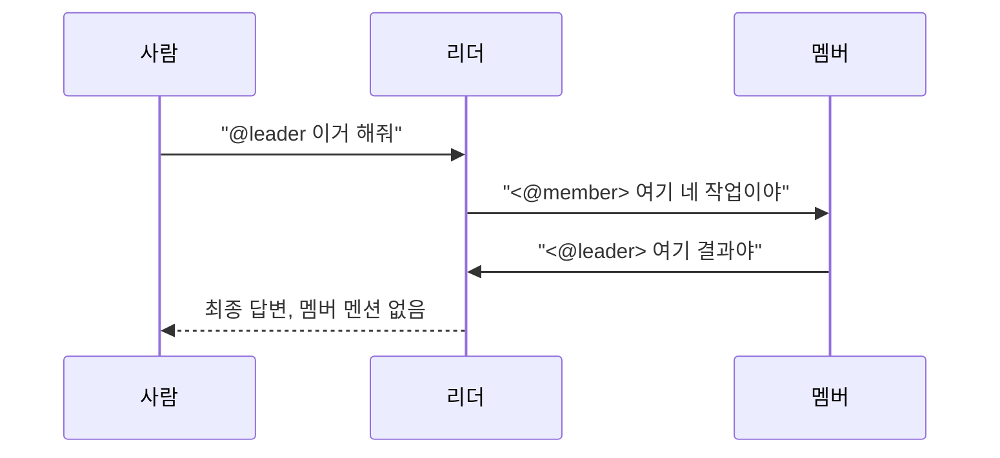

# Hermes 팀 구성하기

Hermes 인스턴스 하나를 배포해 보셨고 이제 여러 에이전트가 함께 일하길 원하신다면,
이 페이지가 그 입문 경로입니다. 먼저 개념을 쉬운 말로 설명하고, 만들 수 있는 두
가지 팀 형태를 각각 가장 작은 예제와 함께 안내합니다. 전체 프로토콜, 모든 설정
값, 라이브로 검증된 증거까지 원하신다면 [Hermes 팀](../reference/teams.md)과
[Hermes 협업](../reference/collaboration.md)을 참고하세요 - 이 페이지는 그
문서들을 읽기 전에 방향을 잡아드리기 위한 것입니다.

## 가장 먼저 이해해야 할 것

**`replicaCount`를 올린다고 Hermes 하나가 "커지지" 않습니다.** Hermes Agent는
개인 에이전트입니다 - 하나의 정체성, 하나의 메모리, 하나의 홈 디렉터리, 하나의
gateway 프로세스. 레플리카를 늘리면 같은 디스크를 두고 다투다 `Pending` 상태로
멈추거나, 서로를 전혀 모르는 완전히 별개의 에이전트가 됩니다.

그래서 이 차트에서 "팀"은 하나의 deployment를 스케일 아웃한 것이 아닙니다.
언제나 **각자 독립된 Helm 릴리스인 여러 개의 단일 인스턴스**가, 공통으로 공유하는
무언가로 - 대개는 하나의 Discord 채널이나 스레드로 - 묶인 형태입니다. 서버를
스케일링한다기보다는 두 번째 사람을 채용한다고 생각하세요: 그 사람도 자기 책상(PVC)과
자기 정체성을 갖고, 여러분은 그 사람을 같은 단체 채팅방에 소개할 뿐입니다.

## 두 가지 형태, 필요에 따라 고르세요

| | **페어 협업** | **리더 주도 팀** |
| --- | --- | --- |
| 누가 누구와 대화하나 | 어떤 에이전트든 다른 에이전트에게 말을 걸 수 있음 | 사람과는 리더만 대화하고, 멤버는 리더에게만 응답 |
| 형태 | 플랫(flat): 둘 또는 소수의 동등한 에이전트 | 스타(star): 리더 하나, 멤버 N명 |
| 적합한 경우 | 가까이서 지켜볼 수 있는, 빠른 2역할 페어(예: 기획자 + 빌더) | 반복 가능하고 명부가 큰, 예측 가능한 단일 접점을 원하는 경우 |
| 자세한 문서 | [collaboration.md](../reference/collaboration.md) | [teams.md](../reference/teams.md#리더-주도-팀-leader-orchestrated-teams) |
| Values 파일 | [`values-multi-agent-collab.yaml`](https://github.com/jyje/hermes-agent-helm/blob/main/charts/hermes-agent/values-multi-agent-collab.yaml) | [`values-team-leader.yaml`](https://github.com/jyje/hermes-agent-helm/blob/main/charts/hermes-agent/values-team-leader.yaml) / [`values-team-member.yaml`](https://github.com/jyje/hermes-agent-helm/blob/main/charts/hermes-agent/values-team-member.yaml) |

둘 중 어느 쪽이 "더 고급"인 것은 아닙니다 - 원하는 대화 흐름에 맞는 형태를
고르세요. 에이전트가 둘뿐이라면 플랫 페어가 이해하기 더 쉽고, 둘셋을 넘어가면
리더 형태가 "누가 뭘 하고 있는지"를 사람이 일일이 추적하지 않아도 되게 해줍니다.

## 빠른 시작: 협업 페어

독립된 릴리스 두 개, 공유하는 Discord 채널 하나, 그리고 핸드오프 신호로 쓰는
명시적 `@멘션`.

1. **[Discord 개발자 포털](https://discord.com/developers/applications)에서 봇
   두 개를 만들고**, 둘 다 Message Content Intent를 켠 뒤 같은 채널에 초대하세요.
   각 봇의 Discord **사용자 ID**를 메모해 두세요 - 각 에이전트는 파트너를
   멘션하려면 그 ID를 알아야 합니다.
2. **둘 다 설치**하되, 각각 [`values-multi-agent-collab.yaml`](https://github.com/jyje/hermes-agent-helm/blob/main/charts/hermes-agent/values-multi-agent-collab.yaml)을
   가리키게 하고 자기 봇 토큰과 파트너 ID를 `environment_hint`에 채워 넣습니다:

   ```bash
   helm upgrade --install hermes-planner ./charts/hermes-agent \
     --namespace hermes-team --create-namespace \
     -f charts/hermes-agent/values-multi-agent-collab.yaml \
     --set-string env.DISCORD_BOT_TOKEN='<planner-bot-token>' --wait

   helm upgrade --install hermes-builder ./charts/hermes-agent \
     --namespace hermes-team --create-namespace \
     -f charts/hermes-agent/values-builder.yaml \
     --set-string env.DISCORD_BOT_TOKEN='<builder-bot-token>' --wait
   ```

3. **채널에서 아무 봇에게나 말을 거세요.** 기획자(planner)에게 무언가를
   스코핑해 달라고 요청하고, 답변에 `<@builder>`로 핸드오프하면 빌더가 자동으로
   이어받습니다. 주제가 마무리되면, 마무리하는 에이전트는 파트너를 멘션하는 대신
   여러분에게 말을 겁니다 - 그게 대화를 멈추게 하는 신호입니다.

이게 전체 흐름입니다. "완료되면 멘션을 멈춘다"를 실제로 강제하는 네 가지 Discord
환경 변수의 원리와, 에이전트 두 개를 넘어 확장하는 방법 같은 전체 레시피는
[collaboration.md](../reference/collaboration.md)에 있습니다.

## 빠른 시작: 리더 주도 팀

사람이 항상 대화하는 리더 하나와, 리더의 명시적 멘션이 있을 때만 동작하는
멤버들.



1. **공유 지식 볼륨 준비**(선택이지만 권장): 리더가 쓰고 멤버가 읽는
   `ReadWriteMany` PVC `hermes-team-knowledge`. 이건 지속적인 참고 자료용이지
   실시간 작업 상태용이 아닙니다 - 실제 작업은 Discord 스레드가 담당합니다.
2. **리더를 설치한 뒤, 멤버마다 릴리스를 하나씩 설치**합니다. 모두 같은
   Discord 채널을 가리켜야 합니다:

   ```bash
   helm upgrade --install hermes-august ./charts/hermes-agent \
     --namespace hermes-team --create-namespace \
     -f charts/hermes-agent/values-team-leader.yaml \
     --set-string env.DISCORD_BOT_TOKEN='<leader-bot-token>' --wait

   helm upgrade --install hermes-may ./charts/hermes-agent \
     --namespace hermes-team \
     -f charts/hermes-agent/values-team-member.yaml \
     --set-string env.DISCORD_BOT_TOKEN='<member-bot-token>' --wait
   ```

3. **채널에서 리더에게 목표를 주세요.** 리더는 한 번에 멤버 한 명에게 위임하고,
   그 멤버의 답을 기다려 검토한 뒤, 수정을 요청하거나 다음 멤버로 넘어갑니다.
   모두 만족스러우면 멤버 멘션 없이 여러분에게 직접 답합니다 - 그게 작업이
   끝났다는 신호입니다. 손으로 `helm install`을 돌리고 싶지 않다면
   `examples/argocd/hermes-team.yaml`에 같은 명부의 선언형(ArgoCD) 버전이
   있습니다.

정확한 위임 메시지 형식, 루프 브레이크에 네 가지 환경 변수가 필요한 이유,
실제 클러스터에서 라이브로 무엇이 증명됐는지를 포함한 전체 프로토콜은
[Hermes 팀](../reference/teams.md#리더-주도-팀-leader-orchestrated-teams)에 있습니다.

## 안전장치가 존재하는 이유

Hermes에는 **봇 대 봇 대화를 막는 내장 제한이 없습니다** - 서로를 보고 멘션할
수 있는 에이전트 둘을 그대로 두면 끝없이 핑퐁을 주고받습니다. 이 페이지의 모든
팀 패턴은 "멈춤"이 실제로 일어나게 만드는 동일한 2단계 브레이크에 의존합니다:

- **프롬프트 지시**: 각 에이전트는 파트너를 멘션하지 *말아야* 할 때를 명시적으로
  지시받습니다(주제가 해결되면 파트너 대신 사람에게 말할 것).
- **Discord 환경 변수 네 개**로, 파트너를 부르는 *유일한* 방법을 메시지 본문에
  적힌 명시적 `<@id>`로 제한합니다 - 답장(reply)도, 스레드 안의 수동적 존재감도,
  그 무엇도 암묵적으로는 안 됩니다. Discord의 답장 기능이 이전 발신자를 자동으로
  ping해서 의도치 않게 루프를 재시작시키는, 눈에 잘 안 띄는 경로를 이렇게
  막습니다.

이 방식은 어디서나 **실험적이며 upstream이 지원하는 토폴로지가 아니라고**
명시되어 있습니다 - 보장이 아니라 완화책이 적용된 레시피로 취급하고, 이 봇들은
지켜볼 수 있는 채널에 두세요.

## 다른 플랫폼: Telegram과 Slack

위 내용은 모두 Discord 기준이며, 라이브로 검증된 멀티봇 실행 이력이 있는
플랫폼은 Discord뿐입니다. 다만 프로토콜 자체는 플랫폼과 무관합니다 - 달라지는
건 멘션을 쓰는 방식과 루프를 닫는 환경 변수뿐입니다:

| | Discord | Telegram | Slack |
| --- | --- | --- | --- |
| 멘션 형식 | `<@USER_ID>` | `@username`(반드시 `bot`으로 끝나야 함) | `<@USER_ID>`: Discord와 동일 |
| 루프 브레이크 값 개수 | 4개 | 3개 | 2개 |
| 절대 놓치면 안 되는 값 | `DISCORD_REPLY_TO_MODE=off` | `TELEGRAM_REPLY_TO_MODE=off` | `SLACK_STRICT_MENTION=true` |
| 라이브 검증 여부 | ✅ | ⚠️ 설정 레벨만 확인 | ⚠️ 설정 레벨만 확인 |

Slack이 가장 이식하기 쉽습니다(멘션 문법이 같아서 `environment_hint` 텍스트를
그대로 재사용 가능). Telegram은 숫자 ID 대신 `@username` 토큰이 필요하고,
팀원을 부를 때 Telegram의 기본 "답장" 기능을 절대 쓰지 말라는 지시가 하나 더
필요합니다.

값 하나하나의 대응표와 두 플랫폼 모두의 실제 설정 예시는
[collaboration.md § Discord 너머로](../reference/collaboration.md#discord-너머-telegram과-slack)
(페어)와 [teams.md § Telegram과 Slack](../reference/teams.md#telegram과-slack)
(리더 팀)에 있습니다.

## 문서로만이 아니라 실제로 증명된 것

실제 kind 클러스터(고정된 Hermes 이미지 `v2026.7.20`)에서의 라이브 실행 두 번이
리더 → 멤버 → 멤버 → 리더 경로를 처음부터 끝까지 완주했고, 마지막 답변에는
멤버 멘션이 없었습니다 - 루프가 실제로 종료된다는 것을 확인한 것입니다. 두
번의 실행 모두의 Discord 스레드 링크와 소요 시간은
[teams.md § 라이브 증거](../reference/teams.md#라이브-증거)에서 볼 수
있습니다.

## 다음으로 볼 것

- [Hermes 팀](../reference/teams.md) - 완전한 레퍼런스: "왜 단일 인스턴스인가"에
  대한 근거, 더 큰 명부를 위한 ArgoCD ApplicationSet 패턴, 전체 리더 팀
  프로토콜.
- [Hermes 협업](../reference/collaboration.md): 완전한 페어 레시피 - 혼합 모델
  백엔드, 파트너 ID를 어디에 둘지(선언적으로 vs. 대화 중 학습), 멀티 에이전트
  ApplicationSet 변형.
- [로드맵](../reference/roadmap.md): 두 팀 형태 모두에서 무엇이 증명됐고 무엇이
  아직 진행 중인지.
