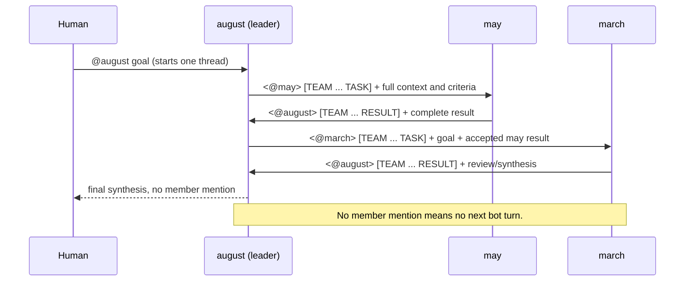

# Hermes teams: scale *up*, then group

[English](teams.md) · [한국어](teams-ko.md)

> TL;DR: **Don't scale a Hermes pod out. Run several well-managed single
> instances and group them into a team that shares one gateway channel.**

## Why Hermes is a single instance

Hermes Agent is a **personal agent**: one `HERMES_HOME`, one
[gateway process](https://hermes-agent.nousresearch.com/docs/user-guide/messaging/),
one memory/identity (`SOUL`, skills, `auth.json`, self-improvement state). The
gateway is explicitly "a single background process that connects to all your
configured platforms, handles sessions, runs cron jobs, and delivers
messages" - it is the *one* hub a single agent talks through.

That makes a single instance a **single-writer workload**, which is why this
chart pins `replicaCount: 1` and refuses to scale out (see the `replicaCount`
note in the [chart README](../charts/hermes-agent/README.md)):

- `controller.type=deployment` → extra replicas hang `Pending` (they can't mount
  the same `ReadWriteOnce` PVC).
- `controller.type=statefulset` → extra replicas become **separate, disconnected
  agents** with their own PVC/identity - not a bigger version of the same agent.

So raising `replicaCount` never gives you "more of the same Hermes." There is no
supported multi-replica mode, by design.

## The model: from lightweight to production

The path from a homelab toy to a production deployment is **scale up, then
group** - never scale out a single agent:

1. **Scale up the one instance.** Give it more `resources`, a larger
   `persistence.size`, a real `storageClass`, probes, and proper secrets
   management (SealedSecret / external-secrets). One instance, well managed.
2. **Group several instances into a team.** When one agent isn't enough (more
   people, more roles, more parallel work), deploy *multiple* single instances
   (each its own release) and join them to **one shared gateway channel** so
   they and your team share a common context bus.

Step 2 is what this page is about.

## How a team shares context

Every Hermes instance connects its own gateway to the **same channel** (for
example, one Discord channel). That shared channel becomes the team's context
bus:

- Each agent reads and posts messages in the channel, so the **conversation
  itself is the shared context** every member - human or agent - sees.
- The channel doubles as the **home channel** (`*_HOME_CHANNEL`): where each
  agent delivers cron results and proactive notifications, per the
  [messaging gateway docs](https://hermes-agent.nousresearch.com/docs/user-guide/messaging/).
- Team-wide knowledge (tech stack, conventions, priorities) is pinned through
  **context files** (`SOUL.md`, `AGENTS.md`) that inject into every session's
  system prompt, as described in the
  [Team Telegram Assistant guide](https://hermes-agent.nousresearch.com/docs/guides/team-telegram-assistant).
- For **shared persistent knowledge** (vector indices or shared reference
  files), keep each private `HERMES_HOME` and mount the **same
  ReadWriteMany (RWX) PVC** at a separate path using `extraVolumes` and
  `extraVolumeMounts`. This lets agents read and write a common knowledge base
  without sharing config, memory, identity, or gateway sessions. See
  [`values-shared-knowledge.yaml`](../charts/hermes-agent/values-shared-knowledge.yaml)
  for a complete example. **Note:** The PVC must use a StorageClass that supports
  `ReadWriteMany` access mode (e.g., NFS, CephFS, Longhorn); most cloud providers'
  default StorageClass is `ReadWriteOnce` and will not work for multiple writers.

> **Honest status (upstream).** Direct agent-to-agent awareness inside one group
> is still evolving in Hermes itself (see upstream issues
> [#10965](https://github.com/NousResearch/hermes-agent/issues/10965),
> [#14853](https://github.com/NousResearch/hermes-agent/issues/14853)). Today the
> reliable team pattern is **humans plus one or more role-scoped agents in a
> shared channel**, each agent addressed by `@mention`. Treat the channel as the
> source of truth; richer cross-agent context injection is on the upstream
> roadmap. For the concrete recipe - how two agents hand the conversation to
> each other by `@mention`, and how to stop them looping forever - see
> [collaboration.md](collaboration.md).

## Build a Hermes team on Discord

A concrete two-agent team in one Discord channel.

### 1. One bot per agent, one shared channel

For each agent you want, create a bot in the
[Discord Developer Portal](https://discord.com/developers/applications), enable
the **Message Content Intent**, and invite **all** of them to the **same server
and the same channel**. Note that channel's ID - it is your shared
`DISCORD_HOME_CHANNEL`, and collect your team's Discord user IDs for
`DISCORD_ALLOWED_USERS`.

### 2. Deploy one instance per bot, same channel

Deploy each agent as its **own release**, each with its **own
`DISCORD_BOT_TOKEN`** but the **same `DISCORD_HOME_CHANNEL`** and the **same
`DISCORD_ALLOWED_USERS`**. With plain Helm, run two installs side by side:

```bash
# Agent A — "planner"
helm upgrade --install hermes-planner ./charts/hermes-agent \
  --namespace hermes-team --create-namespace \
  -f charts/hermes-agent/values-anthropic-and-discord.yaml \
  --set-string env.ANTHROPIC_API_KEY='sk-ant-...' \
  --set-string env.DISCORD_BOT_TOKEN='<planner-bot-token>' \
  --set-string extraEnv[0].name=DISCORD_HOME_CHANNEL \
  --set-string extraEnv[0].value='<shared-channel-id>' --wait

# Agent B — "builder" (same channel, different bot token)
helm upgrade --install hermes-builder ./charts/hermes-agent \
  --namespace hermes-team --create-namespace \
  -f charts/hermes-agent/values-anthropic-and-discord.yaml \
  --set-string env.ANTHROPIC_API_KEY='sk-ant-...' \
  --set-string env.DISCORD_BOT_TOKEN='<builder-bot-token>' \
  --set-string extraEnv[0].name=DISCORD_HOME_CHANNEL \
  --set-string extraEnv[0].value='<shared-channel-id>' --wait
```

Distinct release names (`hermes-planner`, `hermes-builder`) keep every resource
separate - each agent gets its own pod, PVC, and identity, so they are genuinely
independent single instances that happen to share a channel.

### 3. Or generate the team with an ArgoCD ApplicationSet (recommended)

Steps 1–2 don't scale past a couple of members - one Application/install per
agent means hand-editing files for every roster change. An
[ApplicationSet](https://argo-cd.readthedocs.io/en/stable/operator-manual/applicationset/)
turns the roster into **data** and the per-agent Application into a
**template**:

```yaml
apiVersion: argoproj.io/v1alpha1
kind: ApplicationSet
metadata:
  name: hermes-team
  namespace: argocd
spec:
  generators:
    - list:
        elements:
          - name: planner
            botTokenSecret: hermes-planner-discord-secrets
          - name: builder
            botTokenSecret: hermes-builder-discord-secrets
          # add a teammate = add a list entry
  template:
    metadata:
      name: 'hermes-{{name}}'
    spec:
      project: default
      source:
        repoURL: ghcr.io/jyje/hermes-agent-helm
        chart: hermes-agent
        targetRevision: '*'   # pin to a released chart version
        helm:
          releaseName: 'hermes-{{name}}'
          valuesObject:
            env:
              ANTHROPIC_API_KEY: sk-ant-REPLACE_ME
            extraEnvFrom:
              - secretRef:
                  name: '{{botTokenSecret}}'   # per-member secret, created out-of-band
            extraEnv:
              - name: DISCORD_HOME_CHANNEL     # shared across the team
                value: "<shared-channel-id>"
              - name: DISCORD_ALLOWED_USERS    # shared across the team
                value: "<comma-separated-ids>"
      destination:
        server: https://kubernetes.default.svc
        namespace: hermes-team
      syncPolicy:
        syncOptions:
          - CreateNamespace=true
```

This gives you, for the unique-`fullname` rule from
[examples/argocd/](../examples/argocd/) and its
["Multiple instances in the same namespace"](../examples/argocd/README.md#multiple-instances-in-the-same-namespace)
section, for free:

- **The roster lives in one place** - `generators[0].list.elements` - instead of
  N Application files. Adding a teammate is a one-line diff.
- **Shared fields** (`DISCORD_HOME_CHANNEL`, `DISCORD_ALLOWED_USERS`) live once
  in the `template`; **per-member fields** (name, secret ref, role) come from
  the list. This mirrors the chart's own shared-vs-per-instance split
  (`env`/`extraEnvFrom` per release vs. `extraEnv` shared via the template).
- **Unique `fullname` per member** comes for free from `{{name}}` substitution
  in `releaseName`.

If you'd rather see the rendered form explicitly (e.g. for review, or without
ApplicationSet), [examples/argocd/](../examples/argocd/) has one hand-written
Application per provider/example that you can copy per teammate - the
ApplicationSet above is the same shape, generated.

### 4. (Optional) give each agent a role

Each instance has its own `config` and personality, so scope agents to
complementary roles (e.g. a planner vs. a builder) instead of cloning one agent.
Per-team knowledge that everyone should share goes in context files
(`SOUL.md` / `AGENTS.md`) seeded into each instance's `HERMES_HOME`.

> **What's next (exploratory).** The ApplicationSet above covers *templating* a
> team's releases declaratively, which is most of what "a team" needs. A
> dedicated operator (`Agent` / `AgentTeam` CRDs, in a separate repo) would only
> be worth building if that templating-only model falls short in practice.
> For example:
>
> - a **single object reporting team-wide status**
>   (`kubectl get agentteam my-team` → "3/4 members healthy"), which an
>   ApplicationSet doesn't aggregate;
> - **admission-time validation of team-level invariants** (e.g. "every member
>   must share one `DISCORD_HOME_CHANNEL`"), which templating can't enforce;
> - **active reconciliation / state machines** (e.g. reassigning roles when a
>   member becomes unhealthy), which is beyond what a template can express.
>
> Until one of these becomes a real, observed need, the ApplicationSet pattern
> above is the recommended approach. See the [Roadmap](roadmap.md)
> and the [`charts/hermes-operator/`](../charts/hermes-operator/) placeholder.

## Leader-orchestrated teams

The channel-sharing team above is *flat*: every agent may answer. A
**leader-orchestrated team** keeps one visible Discord thread but limits the
conversation graph to a star (demo roster: leader `august`, members `may`
and `march`):

- **Only the leader talks to the human.** Members act only on an explicit body
  mention from `august` and hand their complete result back by explicitly
  mentioning `august`.
- **The Discord thread is the context bus and audit log.** Delegations,
  intermediate results, review feedback, revisions, and the final synthesis are
  messages in the thread. A filesystem path is never a handoff.
- **One transcript spans all senders.** Every team values file sets
  `group_sessions_per_user: false`; otherwise Hermes' default would isolate
  the human, `may`, and `march` into separate sessions inside the same
  thread. `discord.history_backfill: true` supplies visible thread messages
  that arrived while a bot was not addressed.
- **The mention-only loop brake still applies.** `DISCORD_ALLOW_BOTS=mentions`,
  `DISCORD_THREAD_REQUIRE_MENTION=true`, reply references off, and replied-user
  mentions off make a literal `<@BOT_ID>` in the message body the only next-turn
  trigger.

> **Experimental / upstream-unsupported:** Hermes' official Discord guide says
> bot-to-bot conversation has no built-in circuit breaker and is not a
> supported topology. This recipe narrows the risk with one-at-a-time body
> mentions, no reply-reference ping, a prompt-level six-handoff ceiling, and a
> final response with no member mention. Those are mitigations, not an upstream
> support guarantee; keep the bots in a dedicated trusted channel and be ready
> to stop or scale them down during testing.

Each instance still has its normal private `HERMES_HOME` PVC for configuration
and its own gateway session cache. Those PVCs are not shared and do not carry
tasks or results between agents. The examples include a small init container
that gives uid/gid 10000 ownership of this private home because some local-path
provisioners create its root as `root:root 0700`. Discord remains the source of
truth.

Local capability is separate from team coordination. The `file` and `memory`
toolsets remain enabled because an agent may need private scratch files and
durable memory for its own work. Another agent must never be told to read that
private state, and no hook, watcher, scheduler, background process, file write,
memory update, or tool/API call may deliver or trigger a team assignment. Only
the visible Discord message containing the exact bot mention and complete task
or result contract is a handoff.

A second, pre-provisioned `hermes-team-knowledge` RWX PVC is mounted at
`/opt/data/team-knowledge`. The leader mounts it read-write and is the sole
curator; members mount it read-only. It contains durable reusable knowledge,
not live coordination state. The permission boundary reinforces the prompt
contract and avoids multi-writer races.

The reference protocol is deliberately serial. The leader mentions one member,
waits for that member to mention it back, reviews the result, and only then
mentions the next member. With a room-wide session, simultaneous member replies
can contend for one running-agent slot; serialization makes the first live proof
deterministic.



Every delegation carries a small visible contract:

```text
<@MEMBER_ID>

Context: <everything needed, including accepted earlier results>
Task: <one concrete task>
Done when: <observable acceptance criteria>
Reply contract: mention <@LEADER_ID> and include the complete result here.

[TEAM run=<short-id> step=<n> TASK]
```

The mention stays first so the intended bot is obvious and triggered; the TEAM
metadata stays on the final independent line so it does not interrupt the task.

First create the shared knowledge claim with an RWX-capable StorageClass. Its
root must be readable by uid/gid 10000 and writable by uid/gid 10000 for the
leader:

```yaml
apiVersion: v1
kind: PersistentVolumeClaim
metadata:
  name: hermes-team-knowledge
  namespace: hermes-team
spec:
  accessModes: [ReadWriteMany]
  storageClassName: nfs-client # replace with your RWX-capable class
  resources:
    requests:
      storage: 10Gi
```

Then deploy the leader and one release per member. The values files mount the
same claim separately from every agent's private home:

```bash
helm upgrade --install hermes-august ./charts/hermes-agent \
  --namespace hermes-team --create-namespace \
  -f charts/hermes-agent/values-team-leader.yaml \
  --set-string env.NVIDIA_API_KEY='nvapi-<real>' \
  --set-string env.DISCORD_BOT_TOKEN='<august-bot-token>' --wait

helm upgrade --install hermes-may ./charts/hermes-agent \
  --namespace hermes-team \
  -f charts/hermes-agent/values-team-member.yaml \
  --set-string env.NVIDIA_API_KEY='nvapi-<real>' \
  --set-string env.DISCORD_BOT_TOKEN='<may-bot-token>' --wait

# Repeat for march; this index is TEAM_MEMBER_NAME in the member example.
helm upgrade --install hermes-march ./charts/hermes-agent \
  --namespace hermes-team \
  -f charts/hermes-agent/values-team-member.yaml \
  --set-string fullnameOverride=hermes-march \
  --set-string 'extraEnv[6].value=march' \
  --set-string env.NVIDIA_API_KEY='nvapi-<real>' \
  --set-string env.DISCORD_BOT_TOKEN='<march-bot-token>' --wait
```

Replace the channel, allowed-human, and bot IDs in the values files as well.
Declarative users can use
[`examples/argocd/hermes-team.yaml`](../examples/argocd/hermes-team.yaml): one
leader Application plus a member ApplicationSet. Provision the shared claim in
the destination namespace before those Applications sync.

### Live evidence

Two thread-native runs were proven live on 2026-07-30 (KST) with the pinned
`v2026.7.20` image on kind. In both runs the visible route was human → `august`
→ `may` → `august` → `march` → `august` → human:

| Run | Goal and result | Elapsed | Evidence |
| --- | --- | ---: | --- |
| `verify-sum` | `7 + 11 = 18`; `may` calculated, `march` independently verified, `august` synthesized | ~105 s | [Discord thread](https://discord.com/channels/1515526710353858631/1532150987123458088) |
| `verify-sum-01` | `111237 + 7256311 = 7,367,548`; calculation and positional-addition verification agreed | ~96 s | [Discord thread](https://discord.com/channels/1515526710353858631/1532155035495043172) |

The second run also proves the improved presentation contract: the bot mention
is on the first line and `[TEAM run=… step=… TASK|RESULT]` is on its own final
line. Sanitized Discord API read-back confirmed the author/timestamp sequence,
complete results stayed in the thread, and both final leader messages contained
no member mention. All three pods had no `/opt/data/team` path, so no shared-file
handoff was available. Those two conversational runs predated the dedicated
knowledge mount and prove the message protocol, not shared storage. The current
kind structural scenario separately verifies that the leader can write the
knowledge PVC, a member can read the same content, and the member mount rejects
writes. The existing kind screenshot separately proves the independent releases
and private homes.

The live evidence above is **Discord-specific** - it depends on Discord's
thread, mention, reply-reference, and session semantics, and only Discord has
been run through an actual multi-bot proof. Telegram and Slack both have real,
config-verified equivalents of every loop-brake knob (see below), but neither
has a live leader-team run behind it yet; treat the recipes that follow as a
grounded starting point that still needs its own platform-level proof before
you'd trust it unattended.

### Telegram and Slack

The star-topology protocol itself - one leader talking to the human, members
answering only on an explicit mention, the `[TEAM run=<id> step=<n>
TASK|RESULT]` metadata contract, the serialized one-member-at-a-time handoff -
is entirely platform-independent; none of it is Discord API surface. What
changes per platform is **how a mention is written** and **which env vars
close the loop**. See [collaboration.md § Knob
mapping](collaboration.md#knob-mapping) for the full Discord/Telegram/Slack
comparison; the leader-team essentials are below.

**Telegram.** Bots are addressed by `@username` (must end in `bot`), not a
numeric ID - put every member's exact `@username` in the leader's
`environment_hint`, and the leader's `@username` in every member's. Reuse the
`values-team-leader.yaml` / `values-team-member.yaml` `environment_hint` text
verbatim, but replace every `<@ID>` token with `@bot_username` and add one
instruction Discord doesn't need: tell every agent to never use Telegram's
native "reply" feature to address a teammate, since a reply is not the
explicit-mention signal this protocol depends on. The delegation contract
becomes:

```text
@may_bot

Context: <everything needed, including accepted earlier results>
Task: <one concrete task>
Done when: <observable acceptance criteria>
Reply contract: mention @august_bot and include the complete result here.

[TEAM run=<short-id> step=<n> TASK]
```

Swap the leader's `extraEnv` loop-brake block for the Telegram knobs
(`TELEGRAM_ALLOW_BOTS=mentions`, `TELEGRAM_REQUIRE_MENTION=true`,
`TELEGRAM_REPLY_TO_MODE=off`), and set `TELEGRAM_HOME_CHANNEL` /
`TELEGRAM_ALLOWED_USERS` to the shared group chat and trusted human IDs, same
shape as `values-openai-and-telegram.yaml`. `TELEGRAM_EXCLUSIVE_BOT_MENTIONS`
defaults to `true` and is worth keeping: a message that explicitly names one
bot username is ignored by every other bot in the group outright, which adds
a second independent guard against a member acting on a delegation meant for
a sibling.

**Slack.** Mentions use the identical `<@USER_ID>` markup Discord uses, so the
delegation contract and every `environment_hint` carry over unchanged - just
replace Discord user IDs with Slack member IDs. The one knob that matters most
is `SLACK_STRICT_MENTION=true`: Slack's default behavior remembers a thread
once a bot is mentioned in it and keeps that bot listening for the rest of the
thread with no further mention required (the upstream source comments call
this out directly as re-enabling "agent-to-agent ack loops" when left off).
Set the leader and every member's loop-brake block to `SLACK_ALLOW_BOTS=mentions`,
`SLACK_REQUIRE_MENTION=true`, `SLACK_STRICT_MENTION=true`, and point
`SLACK_HOME_CHANNEL` / `SLACK_ALLOWED_USERS` at the shared channel and trusted
humans.

Both platforms need the same `group_sessions_per_user: false` and
`discord.history_backfill`-equivalent care as the Discord recipe: Telegram and
Slack sessions are keyed the same way per sender by default, so the shared
transcript setting stays `config.group_sessions_per_user: false` regardless of
platform. Everything about the shared-knowledge PVC, `disabled_toolsets`, the
six-handoff ceiling, and the "never use a hook/file/memory to hand off work"
rule in `values-team-leader.yaml` / `values-team-member.yaml` applies
unchanged - only the platform block (`env`/`extraEnv`) and the mention token
format in `environment_hint` differ.

### Shared knowledge is separate from coordination

The leader may curate accepted, reusable knowledge under
`/opt/data/team-knowledge`; members may consult it as background. The shared PVC
must never contain run-specific tasks, assignees, queues, status, intermediate
results, completion markers, or next-step instructions. Members must not poll it
for changes, and every delegation must remain fully understandable from the
Discord message alone. A result must reproduce all relevant evidence in the
thread instead of pointing at a path. This keeps durable knowledge useful
without turning it into a hidden coordination plane.

## See also

- [Setting up a team](../guides/team-setup.md): a friendlier, from-scratch
  walkthrough if this is your first team; start there.
- [collaboration.md](collaboration.md) - the next step: make the grouped agents
  hand off by `@mention` and stop them looping (the bot-to-bot recipe).
- [Chart README](../charts/hermes-agent/README.md): full values table, the
  `replicaCount` single-writer rationale, and Discord/Telegram env vars.
- [Roadmap](roadmap.md): the ApplicationSet-based team pattern, and
  the conditions under which a `hermes-operator` (`Agent` / `AgentTeam` CRDs)
  would become worth building.
- [examples/argocd/](../examples/argocd/): one Application per agent, multiple
  instances per namespace, SealedSecret secret wiring.
- Hermes official docs:
  [Messaging gateway](https://hermes-agent.nousresearch.com/docs/user-guide/messaging/)
  ·
  [Team Telegram Assistant](https://hermes-agent.nousresearch.com/docs/guides/team-telegram-assistant)
