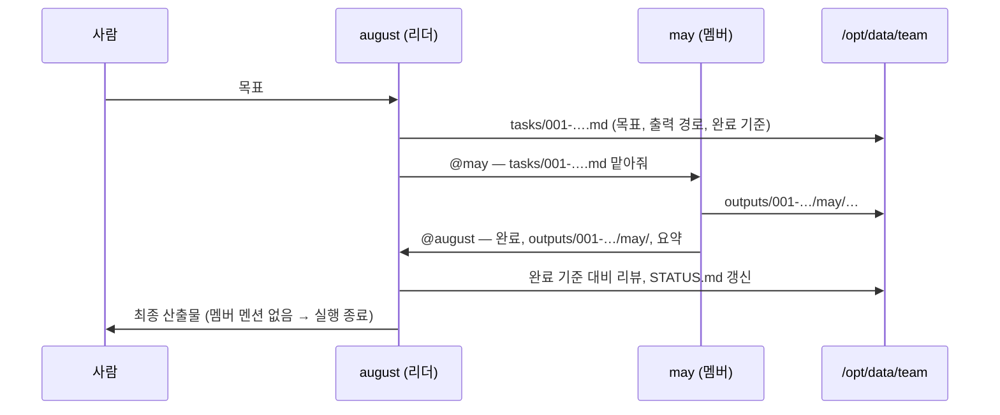
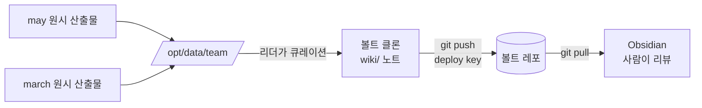

# Hermes 팀: 스케일 *업*, 그리고 그룹

[English](teams.md) · [한국어](teams-ko.md)

> 한 줄 요약 — **Hermes 파드를 스케일 아웃하지 마세요. 잘 관리된 단일 인스턴스를
> 여러 개 띄우고, 하나의 gateway 채널을 공유하는 팀으로 묶으세요.**

## Hermes가 단일 인스턴스인 이유

Hermes Agent는 **개인용 에이전트**입니다: 하나의 `HERMES_HOME`, 하나의
[gateway 프로세스](https://hermes-agent.nousresearch.com/docs/user-guide/messaging/),
하나의 메모리/정체성(`SOUL`, skills, `auth.json`, self-improvement 상태). gateway는
공식 문서에서 명시하듯 "설정된 모든 플랫폼에 연결되어 세션을 처리하고 cron을 실행하며
메시지를 전달하는 단일 백그라운드 프로세스"입니다 — 하나의 에이전트가 거치는 *유일한*
허브죠.

그래서 단일 인스턴스는 **단일 writer 워크로드**가 되고, 이 차트가 `replicaCount: 1`을
고정하며 스케일 아웃을 지양하는 이유입니다([차트 README](../charts/hermes-agent/README.md)의
`replicaCount` 설명 참고):

- `controller.type=deployment` → 추가 레플리카는 `Pending`에 걸립니다
  (동일한 `ReadWriteOnce` PVC를 마운트할 수 없음).
- `controller.type=statefulset` → 추가 레플리카는 각자의 PVC/정체성을 가진
  **별개의, 단절된 에이전트**가 됩니다 — 같은 에이전트의 더 큰 버전이 아닙니다.

따라서 `replicaCount`를 올려도 "같은 Hermes가 더 많아지는" 일은 없습니다. 설계상
지원되는 멀티 레플리카 모드는 없습니다.

## 모델: 경량부터 프로덕션까지

홈랩 장난감에서 프로덕션 배포로 가는 길은 **스케일 '업'하고, 그다음 그룹 만들기**입니다 — 단일
에이전트를 스케일 아웃하는 게 아닙니다:

1. **단일 인스턴스의 스팩을 키웁니다.** `resources`를 늘리고, `persistence.size`를 키우고,
   실제 `storageClass`·probe·제대로 된 시크릿 관리(SealedSecret / external-secrets)를
   붙이세요. 하나의 인스턴스를, 잘.
2. **여러 인스턴스를 팀으로 묶습니다.** 한 에이전트로 부족할 때(사람이 늘고, 역할이
   늘고, 병렬 작업이 늘 때) *여러* 단일 인스턴스를 — 각각 독립 릴리즈로 — 배포하고,
   **하나의 공유 gateway 채널**에 합류시켜 에이전트와 팀이 공통 컨텍스트 버스를
   공유하게 합니다.

이 문서는 2번에 대한 이야기입니다.

## 팀이 컨텍스트를 공유하는 방식

각 Hermes 인스턴스는 자신의 gateway를 **같은 채널**(예: 하나의 Discord 채널)에
연결합니다. 그 공유 채널이 팀의 컨텍스트 버스가 됩니다:

- 각 에이전트가 채널에서 메시지를 읽고 쓰므로, **대화 자체가** 사람이든 에이전트든
  모든 구성원이 보는 **공유 컨텍스트**가 됩니다.
- 그 채널은 동시에 **home 채널**(`*_HOME_CHANNEL`) 역할을 합니다 — 각 에이전트가
  cron 결과와 능동적 알림을 전달하는 곳이며,
  [messaging gateway 문서](https://hermes-agent.nousresearch.com/docs/user-guide/messaging/)에
  설명돼 있습니다.
- 팀 전체가 공유해야 할 지식(기술 스택, 컨벤션, 우선순위)은 **컨텍스트 파일**
  (`SOUL.md`, `AGENTS.md`)로 고정합니다 — 매 세션의 시스템 프롬프트에 주입되며,
  [Team Telegram Assistant 가이드](https://hermes-agent.nousresearch.com/docs/guides/team-telegram-assistant)에
  나옵니다.
- **공유 영속적 지식** (벡터 인덱스, 대화 내역, 또는 공유 config 파일)을 위해, 모든
  에이전트가 `persistence.existingClaim` 필드를 사용하여 **같은 ReadWriteMany (RWX)
  PVC**를 마운트할 수 있습니다. 이렇게 하면 에이전트들이 공통 지식 베이스에 읽기/쓰기를
  할 수 있습니다. 완전한 예는
  [`values-shared-knowledge.yaml`](../charts/hermes-agent/values-shared-knowledge.yaml)을
  참조하세요. **주의:** PVC는 `ReadWriteMany` 액세스 모드를 지원하는 StorageClass를
  사용해야 합니다(예: NFS, CephFS, Longhorn); 대부분의 클라우드 제공자의 기본
  StorageClass는 `ReadWriteOnce`이므로 다중 작성자는 동작하지 않습니다.

> **솔직한 현황(업스트림).** 하나의 그룹 안에서 에이전트끼리 직접 인지하는 기능은
> Hermes 자체에서 아직 발전 중입니다(업스트림 이슈
> [#10965](https://github.com/NousResearch/hermes-agent/issues/10965),
> [#14853](https://github.com/NousResearch/hermes-agent/issues/14853) 참고). 현재
> 신뢰할 수 있는 팀 패턴은 **공유 채널에 사람 + 역할별 에이전트 한둘**을 두고 각
> 에이전트를 `@mention`으로 부르는 것입니다. 채널을 단일 진실 공급원으로 삼으세요;
> 더 풍부한 에이전트 간 컨텍스트 주입은 업스트림 로드맵에 있습니다.

## Discord로 Hermes 팀 만들기

하나의 Discord 채널에 두 에이전트로 구성한 구체적 예시입니다.

### 1. 에이전트마다 봇 1개, 공유 채널 1개

원하는 에이전트마다
[Discord Developer Portal](https://discord.com/developers/applications)에서 봇을
만들고 **Message Content Intent**를 켠 뒤, **모두**를 **같은 서버·같은 채널**에
초대하세요. 그 채널 ID를 메모해 두면 공유 `DISCORD_HOME_CHANNEL`이 되고, 팀원들의
Discord 사용자 ID를 모아 `DISCORD_ALLOWED_USERS`로 씁니다.

### 2. 봇마다 인스턴스 1개, 같은 채널로

각 에이전트를 **독립 릴리즈**로 배포하되, **각자의 `DISCORD_BOT_TOKEN`**을 쓰고
**`DISCORD_HOME_CHANNEL`과 `DISCORD_ALLOWED_USERS`는 동일하게** 둡니다. 순수 Helm으로는
두 설치를 나란히 실행합니다:

```bash
# 에이전트 A — "planner"
helm upgrade --install hermes-planner ./charts/hermes-agent \
  --namespace hermes-team --create-namespace \
  -f charts/hermes-agent/values-anthropic-and-discord.yaml \
  --set-string env.ANTHROPIC_API_KEY='sk-ant-...' \
  --set-string env.DISCORD_BOT_TOKEN='<planner-bot-token>' \
  --set-string extraEnv[0].name=DISCORD_HOME_CHANNEL \
  --set-string extraEnv[0].value='<shared-channel-id>' --wait

# 에이전트 B — "builder" (같은 채널, 다른 봇 토큰)
helm upgrade --install hermes-builder ./charts/hermes-agent \
  --namespace hermes-team --create-namespace \
  -f charts/hermes-agent/values-anthropic-and-discord.yaml \
  --set-string env.ANTHROPIC_API_KEY='sk-ant-...' \
  --set-string env.DISCORD_BOT_TOKEN='<builder-bot-token>' \
  --set-string extraEnv[0].name=DISCORD_HOME_CHANNEL \
  --set-string extraEnv[0].value='<shared-channel-id>' --wait
```

릴리즈 이름을 다르게(`hermes-planner`, `hermes-builder`) 두면 모든 리소스가 분리됩니다 —
각 에이전트가 자신의 파드·PVC·정체성을 가지므로, 채널만 공유할 뿐 진짜로 독립적인 단일
인스턴스들이 됩니다.

### 3. 또는 ArgoCD ApplicationSet으로 팀을 생성하기 (권장)

1~2단계는 멤버가 몇 명을 넘어가면 확장되지 않습니다 — 에이전트마다 Application/설치를
하나씩 두면, 명부가 바뀔 때마다 파일을 손으로 고쳐야 합니다.
[ApplicationSet](https://argo-cd.readthedocs.io/en/stable/operator-manual/applicationset/)은
명부를 **데이터**로, 에이전트당 Application을 **템플릿**으로 바꿉니다:

```yaml
apiVersion: argoproj.io/v1alpha1
kind: ApplicationSet
metadata:
  name: hermes-team
  namespace: argocd
spec:
  generators:
    - list:
        elements:
          - name: planner
            botTokenSecret: hermes-planner-discord-secrets
          - name: builder
            botTokenSecret: hermes-builder-discord-secrets
          # 팀원 추가 = 리스트 항목 추가
  template:
    metadata:
      name: 'hermes-{{name}}'
    spec:
      project: default
      source:
        repoURL: ghcr.io/jyje/hermes-agent-helm
        chart: hermes-agent
        targetRevision: '*'   # 릴리즈된 차트 버전으로 고정
        helm:
          releaseName: 'hermes-{{name}}'
          valuesObject:
            env:
              ANTHROPIC_API_KEY: sk-ant-REPLACE_ME
            extraEnvFrom:
              - secretRef:
                  name: '{{botTokenSecret}}'   # 멤버별 시크릿, 별도 생성
            extraEnv:
              - name: DISCORD_HOME_CHANNEL     # 팀 전체 공유
                value: "<shared-channel-id>"
              - name: DISCORD_ALLOWED_USERS    # 팀 전체 공유
                value: "<comma-separated-ids>"
      destination:
        server: https://kubernetes.default.svc
        namespace: hermes-team
      syncPolicy:
        syncOptions:
          - CreateNamespace=true
```

이렇게 하면 [examples/argocd/](../examples/argocd/)와
["Multiple instances in the same namespace"](../examples/argocd/README.md#multiple-instances-in-the-same-namespace)
섹션의 `fullname` 유일성 규칙을 그대로 따르면서, 다음을 거의 공짜로 얻습니다:

- **명부가 한 곳**(`generators[0].list.elements`)**에 존재** — N개의 Application
  파일이 아니라. 팀원 추가는 한 줄짜리 diff입니다.
- **공유 필드**(`DISCORD_HOME_CHANNEL`, `DISCORD_ALLOWED_USERS`)는 `template`에
  한 번만 두고, **멤버별 필드**(이름, 시크릿 참조, 역할)는 리스트에서 옵니다 —
  차트 자체의 공유/인스턴스별 분리(`env`/`extraEnvFrom`은 릴리즈별, `extraEnv`는
  template으로 공유)와 같은 모양입니다.
- **멤버별 유일한 `fullname`**은 `releaseName`의 `{{name}}` 치환에서 자동으로
  나옵니다.

렌더링된 형태를 명시적으로 보고 싶다면(예: 리뷰용, 또는 ApplicationSet 없이),
[examples/argocd/](../examples/argocd/)에 제공자/예제별로 손으로 작성한 Application이
하나씩 있습니다 — 팀원마다 복사해서 쓸 수 있고, 위 ApplicationSet은 같은 모양을
생성하는 것뿐입니다.

### 4. (선택) 각 에이전트에 역할 부여

각 인스턴스는 자신의 `config`와 personality를 가지므로, 한 에이전트를 복제하기보다
상호 보완적인 역할(예: planner vs. builder)로 범위를 나누세요. 모두가 공유해야 할
팀 지식은 각 인스턴스의 `HERMES_HOME`에 심는 컨텍스트 파일(`SOUL.md` / `AGENTS.md`)에
둡니다.

> **다음 단계(탐색적).** 위 ApplicationSet은 팀의 릴리즈를 선언적으로
> **템플릿화**하는 부분을 커버하며, 이게 "팀"에 필요한 것의 대부분입니다.
> 전용 오퍼레이터(`Agent` / `AgentTeam` CRD, 별도 레포)는 이 템플릿 전용 모델이
> 실제로 부족해질 때만 가치가 있습니다 — 예를 들어:
>
> - **팀 전체 상태를 보여주는 단일 오브젝트**(`kubectl get agentteam my-team` →
>   "3/4 멤버 healthy")가 필요한데, ApplicationSet은 이를 집계해주지 않을 때;
> - **팀 단위 불변식의 admission-time 검증**(예: "모든 멤버는 동일한
>   `DISCORD_HOME_CHANNEL`을 공유해야 한다")이 필요한데, 템플릿으로는 강제할 수
>   없을 때;
> - **능동적 reconcile/상태 기계**(예: 멤버 장애 시 역할 재배정)가 필요한데,
>   템플릿이 표현할 수 있는 범위를 넘어설 때.
>
> 이 중 하나가 실제로, 관찰된 필요가 되기 전까지는 위 ApplicationSet 패턴이
> 권장 접근입니다. [로드맵](roadmap-ko.md)과
> [`charts/hermes-operator/`](../charts/hermes-operator/) 플레이스홀더를
> 참고하세요.

## 리더 주도 팀 (Leader-orchestrated teams)

위의 채널 공유 팀은 *플랫(flat)*합니다: 모든 에이전트가 모든 것을 듣고, 누구든
답할 수 있습니다. 페어([collaboration-ko.md](collaboration-ko.md))에서는 잘
동작하지만, 멤버가 둘을 넘으면 멘션 에티켓이 무너지기 시작합니다 — 모두가 모두를
핑하고, 페어에서 검증한 루프 브레이크만으로는 부족해집니다. 다음 성숙 단계는
**리더 주도 팀**(데모 로스터: 리더 `august`, 멤버 `may`와 `march`)이며, 두 가지
규칙이 추가됩니다:

- **스타 토폴로지 (컨트롤 플레인).** 사람은 리더에게만 말합니다. 멘션은
  리더 ↔ 멤버 사이로만 흐르고, 멤버 ↔ 멤버는 절대 없습니다 — 그래서 모든 대화
  간선(edge)이 여전히 *페어*이고, [collaboration-ko.md](collaboration-ko.md)의
  루프 브레이크가 에이전트 N명에서도 계속 유효합니다.
- **공유 워크스페이스, 경로당 단일 writer (데이터 플레인).** 작업 산출물은
  절대 채팅으로 옮기지 않습니다. 모든 에이전트가 하나의 공유 RWX PVC를
  `extraVolumes`로 `/opt/data/team`에 마운트하되, **각자의 사설 `HERMES_HOME`은
  유지합니다** — 홈 전체를 공유하면 에이전트별 `config.yaml` 시드가 서로를
  덮어쓰기 때문입니다. `/opt/data/team`은 이미지의 쓰기 안전 루트
  (`HERMES_WRITE_SAFE_ROOT=/opt/data`) 안에 있으므로 쓰기 가드를 느슨하게
  할 필요가 없습니다. RWX에는 파일 잠금이 없으므로, 레이아웃이 모든 경로에
  정확히 한 명의 writer만 두도록 합니다:

  ```
  /opt/data/team/
  ├── tasks/<task-id>.md            # 리더가 쓰고, 멤버는 읽기만
  ├── outputs/<task-id>/<member>/   # 해당 멤버만 씀
  └── STATUS.md                     # 리더가 유일한 writer
  ```

실행 라이프사이클 전체:



두 개의 예제 values 파일로 배포합니다(리더/멤버 프로토콜은 각자의
`environment_hint`에 있습니다 — 차트 자체에는 새로운 게 필요 없습니다):

```bash
# 0. 공유 RWX 워크스페이스 PVC를 먼저 한 번 생성 (매니페스트는 파일 헤더에)
# 1. 리더
helm upgrade --install hermes-august ./charts/hermes-agent \
  --namespace hermes-team --create-namespace \
  -f charts/hermes-agent/values-team-leader.yaml \
  --set-string env.NVIDIA_API_KEY='nvapi-<real>' \
  --set-string env.DISCORD_BOT_TOKEN='<august-bot-token>' --wait

# 2. 각 멤버 (march도 동일하게 반복)
helm upgrade --install hermes-may ./charts/hermes-agent \
  -n hermes-team -f charts/hermes-agent/values-team-member.yaml \
  --set-string fullnameOverride=hermes-may \
  --set-string env.NVIDIA_API_KEY='nvapi-<real>' \
  --set-string env.DISCORD_BOT_TOKEN='<may-bot-token>' --wait
```

또는 선언적으로:
[`examples/argocd/hermes-team.yaml`](../examples/argocd/hermes-team.yaml)이
렌더링된 형태입니다 — 리더용 Application 하나 + 멤버 로스터가 데이터인
ApplicationSet(팀원 추가 = 리스트 항목 하나 추가).

여기의 데모는 **Discord 우선**입니다(봇 토큰 플랫폼은 추가 인프라가 필요
없습니다). 게이트웨이는 모든 플랫폼을 그저 또 하나의 자격증명으로 다루므로,
플랫폼 환경변수만 바꾸면 같은 스타 토폴로지가 Telegram이나 Slack에도 그대로
적용됩니다.

### 팀 + 위키 볼트 (git 기반)

원시 작업 산출물은 쌓이기만 합니다; 팀 지식의 지속 가능한 형태는 큐레이션된
**Obsidian 호환 위키 볼트**입니다 — 그리고 위의 단일 writer 규칙이 이미 누가
큐레이션하는지 말해줍니다: **오직 리더만**. 멤버는 원시 산출물을 쓰고, 리더가
승인된 결과를 볼트로 승격합니다(`[[링크]]`, 태그, 노트별 `Updated:` 날짜) —
사람의 지식 베이스가 쓰는 raw → wiki 분리와 동일합니다.

볼트를 (PVC 전용이 아니라) **git 기반**으로 유지하면 산출물이 이식 가능하고
리뷰 가능해집니다: 리더가 볼트 레포를 워크스페이스에 클론하고, 큐레이션한
노트를 커밋하고, 푸시합니다; 사람은 `git pull`해서 Obsidian으로 봅니다.
리더가 **유일한 pusher**이므로 푸시 경합이 없습니다. Kubernetes에서 이것에
필요한 자격증명은 정확히 하나 — 파일로 마운트되는 레포 범위의 **deploy key** —
이며, 차트의 `extraVolumes`/`extraVolumeMounts` 확장 지점이 바로 그 용도입니다:



```bash
# 일회성 설정
ssh-keygen -t ed25519 -f vault-key -N '' -C hermes-august-vault
ssh-keyscan github.com > known_hosts     # 호스트 키 고정
kubectl create secret generic team-vault-deploy-key -n hermes-team \
  --from-file=id_ed25519=vault-key --from-file=known_hosts=known_hosts
# vault-key.pub을 볼트 레포에 WRITE deploy key로 등록
```

그다음 [`values-team-leader.yaml`](../charts/hermes-agent/values-team-leader.yaml)
하단의 볼트 블록 주석을 해제하세요: 키를 `/var/run/secrets/vault-git`에
읽기 전용으로 마운트하고 `GIT_SSH_COMMAND`가 그 키를 쓰도록 하며,
`known_hosts`를 고정합니다. 언급할 가치가 있는 보안 태세: deploy key는 볼트
레포 **하나**로 범위가 제한되고(다른 곳에는 쓰기 권한 없음), `0400`으로
마운트된 Secret에 있으며 — 절대 환경변수가 아님 — 멤버는 키를 전혀 받지
않습니다.

## 함께 보기

- [collaboration-ko.md](collaboration-ko.md) — 다음 단계: 묶인 에이전트들이
  `@mention`으로 핸드오프하고 무한루프를 멈추게 하기(봇 대 봇 레시피).
- [차트 README](../charts/hermes-agent/README.md) — 전체 값 테이블,
  `replicaCount` 단일 writer 근거, Discord/Telegram 환경변수.
- [로드맵](roadmap-ko.md) — ApplicationSet 기반 팀 패턴, 그리고
  `hermes-operator`(`Agent` / `AgentTeam` CRD)가 정당화되는 조건.
- [examples/argocd/](../examples/argocd/) — 에이전트당 Application 1개, 네임스페이스당
  다중 인스턴스, SealedSecret 시크릿 연결.
- Hermes 공식 문서:
  [Messaging gateway](https://hermes-agent.nousresearch.com/docs/user-guide/messaging/)
  ·
  [Team Telegram Assistant](https://hermes-agent.nousresearch.com/docs/guides/team-telegram-assistant)
