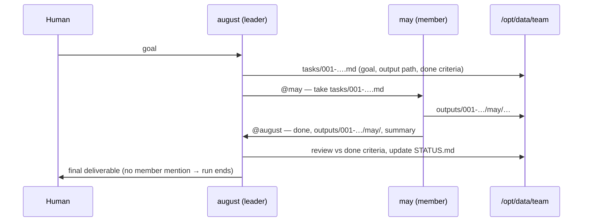
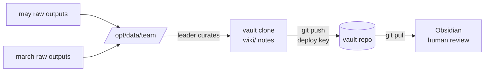

# Hermes teams: scale *up*, then group

[English](teams.md) · [한국어](teams-ko.md)

> TL;DR — **Don't scale a Hermes pod out. Run several well-managed single
> instances and group them into a team that shares one gateway channel.**

## Why Hermes is a single instance

Hermes Agent is a **personal agent**: one `HERMES_HOME`, one
[gateway process](https://hermes-agent.nousresearch.com/docs/user-guide/messaging/),
one memory/identity (`SOUL`, skills, `auth.json`, self-improvement state). The
gateway is explicitly "a single background process that connects to all your
configured platforms, handles sessions, runs cron jobs, and delivers
messages" — it is the *one* hub a single agent talks through.

That makes a single instance a **single-writer workload**, which is why this
chart pins `replicaCount: 1` and refuses to scale out (see the `replicaCount`
note in the [chart README](../charts/hermes-agent/README.md)):

- `controller.type=deployment` → extra replicas hang `Pending` (they can't mount
  the same `ReadWriteOnce` PVC).
- `controller.type=statefulset` → extra replicas become **separate, disconnected
  agents** with their own PVC/identity — not a bigger version of the same agent.

So raising `replicaCount` never gives you "more of the same Hermes." There is no
supported multi-replica mode, by design.

## The model: from lightweight to production

The path from a homelab toy to a production deployment is **scale up, then
group** — never scale out a single agent:

1. **Scale up the one instance.** Give it more `resources`, a larger
   `persistence.size`, a real `storageClass`, probes, and proper secrets
   management (SealedSecret / external-secrets). One instance, well managed.
2. **Group several instances into a team.** When one agent isn't enough (more
   people, more roles, more parallel work), deploy *multiple* single instances —
   each its own release — and join them to **one shared gateway channel** so
   they and your team share a common context bus.

Step 2 is what this page is about.

## How a team shares context

Every Hermes instance connects its own gateway to the **same channel** (for
example, one Discord channel). That shared channel becomes the team's context
bus:

- Each agent reads and posts messages in the channel, so the **conversation
  itself is the shared context** every member — human or agent — sees.
- The channel doubles as the **home channel** (`*_HOME_CHANNEL`): where each
  agent delivers cron results and proactive notifications, per the
  [messaging gateway docs](https://hermes-agent.nousresearch.com/docs/user-guide/messaging/).
- Team-wide knowledge (tech stack, conventions, priorities) is pinned through
  **context files** (`SOUL.md`, `AGENTS.md`) that inject into every session's
  system prompt, as described in the
  [Team Telegram Assistant guide](https://hermes-agent.nousresearch.com/docs/guides/team-telegram-assistant).
- For **shared persistent knowledge** (vector indices, conversation history, or
  shared config files), you can have all agents mount the **same ReadWriteMany
  (RWX) PVC** using the `persistence.existingClaim` field. This lets agents
  read and write to a common knowledge base. See
  [`values-shared-knowledge.yaml`](../charts/hermes-agent/values-shared-knowledge.yaml)
  for a complete example. **Note:** The PVC must use a StorageClass that supports
  `ReadWriteMany` access mode (e.g., NFS, CephFS, Longhorn); most cloud providers'
  default StorageClass is `ReadWriteOnce` and will not work for multiple writers.

> **Honest status (upstream).** Direct agent-to-agent awareness inside one group
> is still evolving in Hermes itself (see upstream issues
> [#10965](https://github.com/NousResearch/hermes-agent/issues/10965),
> [#14853](https://github.com/NousResearch/hermes-agent/issues/14853)). Today the
> reliable team pattern is **humans plus one or more role-scoped agents in a
> shared channel**, each agent addressed by `@mention`. Treat the channel as the
> source of truth; richer cross-agent context injection is on the upstream
> roadmap. For the concrete recipe — how two agents hand the conversation to
> each other by `@mention`, and how to stop them looping forever — see
> [collaboration.md](collaboration.md).

## Build a Hermes team on Discord

A concrete two-agent team in one Discord channel.

### 1. One bot per agent, one shared channel

For each agent you want, create a bot in the
[Discord Developer Portal](https://discord.com/developers/applications), enable
the **Message Content Intent**, and invite **all** of them to the **same server
and the same channel**. Note that channel's ID — it is your shared
`DISCORD_HOME_CHANNEL`, and collect your team's Discord user IDs for
`DISCORD_ALLOWED_USERS`.

### 2. Deploy one instance per bot, same channel

Deploy each agent as its **own release**, each with its **own
`DISCORD_BOT_TOKEN`** but the **same `DISCORD_HOME_CHANNEL`** and the **same
`DISCORD_ALLOWED_USERS`**. With plain Helm, run two installs side by side:

```bash
# Agent A — "planner"
helm upgrade --install hermes-planner ./charts/hermes-agent \
  --namespace hermes-team --create-namespace \
  -f charts/hermes-agent/values-anthropic-and-discord.yaml \
  --set-string env.ANTHROPIC_API_KEY='sk-ant-...' \
  --set-string env.DISCORD_BOT_TOKEN='<planner-bot-token>' \
  --set-string extraEnv[0].name=DISCORD_HOME_CHANNEL \
  --set-string extraEnv[0].value='<shared-channel-id>' --wait

# Agent B — "builder" (same channel, different bot token)
helm upgrade --install hermes-builder ./charts/hermes-agent \
  --namespace hermes-team --create-namespace \
  -f charts/hermes-agent/values-anthropic-and-discord.yaml \
  --set-string env.ANTHROPIC_API_KEY='sk-ant-...' \
  --set-string env.DISCORD_BOT_TOKEN='<builder-bot-token>' \
  --set-string extraEnv[0].name=DISCORD_HOME_CHANNEL \
  --set-string extraEnv[0].value='<shared-channel-id>' --wait
```

Distinct release names (`hermes-planner`, `hermes-builder`) keep every resource
separate — each agent gets its own pod, PVC, and identity, so they are genuinely
independent single instances that happen to share a channel.

### 3. Or generate the team with an ArgoCD ApplicationSet (recommended)

Steps 1–2 don't scale past a couple of members — one Application/install per
agent means hand-editing files for every roster change. An
[ApplicationSet](https://argo-cd.readthedocs.io/en/stable/operator-manual/applicationset/)
turns the roster into **data** and the per-agent Application into a
**template**:

```yaml
apiVersion: argoproj.io/v1alpha1
kind: ApplicationSet
metadata:
  name: hermes-team
  namespace: argocd
spec:
  generators:
    - list:
        elements:
          - name: planner
            botTokenSecret: hermes-planner-discord-secrets
          - name: builder
            botTokenSecret: hermes-builder-discord-secrets
          # add a teammate = add a list entry
  template:
    metadata:
      name: 'hermes-{{name}}'
    spec:
      project: default
      source:
        repoURL: ghcr.io/jyje/hermes-agent-helm
        chart: hermes-agent
        targetRevision: '*'   # pin to a released chart version
        helm:
          releaseName: 'hermes-{{name}}'
          valuesObject:
            env:
              ANTHROPIC_API_KEY: sk-ant-REPLACE_ME
            extraEnvFrom:
              - secretRef:
                  name: '{{botTokenSecret}}'   # per-member secret, created out-of-band
            extraEnv:
              - name: DISCORD_HOME_CHANNEL     # shared across the team
                value: "<shared-channel-id>"
              - name: DISCORD_ALLOWED_USERS    # shared across the team
                value: "<comma-separated-ids>"
      destination:
        server: https://kubernetes.default.svc
        namespace: hermes-team
      syncPolicy:
        syncOptions:
          - CreateNamespace=true
```

This gives you, for the unique-`fullname` rule from
[examples/argocd/](../examples/argocd/) and its
["Multiple instances in the same namespace"](../examples/argocd/README.md#multiple-instances-in-the-same-namespace)
section, for free:

- **The roster lives in one place** — `generators[0].list.elements` — instead of
  N Application files. Adding a teammate is a one-line diff.
- **Shared fields** (`DISCORD_HOME_CHANNEL`, `DISCORD_ALLOWED_USERS`) live once
  in the `template`; **per-member fields** (name, secret ref, role) come from
  the list. This mirrors the chart's own shared-vs-per-instance split
  (`env`/`extraEnvFrom` per release vs. `extraEnv` shared via the template).
- **Unique `fullname` per member** comes for free from `{{name}}` substitution
  in `releaseName`.

If you'd rather see the rendered form explicitly (e.g. for review, or without
ApplicationSet), [examples/argocd/](../examples/argocd/) has one hand-written
Application per provider/example that you can copy per teammate — the
ApplicationSet above is the same shape, generated.

### 4. (Optional) give each agent a role

Each instance has its own `config` and personality, so scope agents to
complementary roles (e.g. a planner vs. a builder) instead of cloning one agent.
Per-team knowledge that everyone should share goes in context files
(`SOUL.md` / `AGENTS.md`) seeded into each instance's `HERMES_HOME`.

> **What's next (exploratory).** The ApplicationSet above covers *templating* a
> team's releases declaratively, which is most of what "a team" needs. A
> dedicated operator (`Agent` / `AgentTeam` CRDs, in a separate repo) would only
> be worth building if that templating-only model falls short in practice —
> for example:
>
> - a **single object reporting team-wide status**
>   (`kubectl get agentteam my-team` → "3/4 members healthy"), which an
>   ApplicationSet doesn't aggregate;
> - **admission-time validation of team-level invariants** (e.g. "every member
>   must share one `DISCORD_HOME_CHANNEL`"), which templating can't enforce;
> - **active reconciliation / state machines** (e.g. reassigning roles when a
>   member becomes unhealthy), which is beyond what a template can express.
>
> Until one of these becomes a real, observed need, the ApplicationSet pattern
> above is the recommended approach. See the [Roadmap](roadmap.md)
> and the [`charts/hermes-operator/`](../charts/hermes-operator/) placeholder.

## Leader-orchestrated teams

The channel-sharing team above is *flat*: every agent hears everything and any
agent may answer. That works for a pair
([collaboration.md](collaboration.md)), but past two members the mention
etiquette degrades — everyone pings everyone, and the pair-tested loop brake
stops being enough. The next maturity step is a **leader-orchestrated team**
(demo roster: leader `august`, members `may` and `march`), which adds two rules:

- **Star topology (control plane).** The human talks only to the leader.
  Mentions flow leader ↔ member only, never member ↔ member — so every
  conversation edge is still a *pair*, and the loop brake from
  [collaboration.md](collaboration.md) keeps holding with N agents.
- **Shared workspace, single writer per path (data plane).** Work products
  never travel through chat. Every agent mounts one shared RWX PVC at
  `/opt/data/team` via `extraVolumes` while keeping its **own private
  `HERMES_HOME`** — sharing the whole home would make the per-agent
  `config.yaml` seeds overwrite each other. `/opt/data/team` sits inside the
  image's write-safe root (`HERMES_WRITE_SAFE_ROOT=/opt/data`), so no write
  guard needs loosening. There is no file locking on RWX, so the layout gives
  every path exactly one writer:

  ```
  /opt/data/team/
  ├── tasks/<task-id>.md            # leader writes, members read
  ├── outputs/<task-id>/<member>/   # ONLY that member writes
  └── STATUS.md                     # leader is the only writer
  ```

The run lifecycle, end to end:



Deploy it with the two example values files (leader protocol and member
protocol live in their `environment_hint`s — the chart itself needs nothing
new):

```bash
# 0. create the shared RWX workspace PVC once (manifest in the file header)
# 1. the leader
helm upgrade --install hermes-august ./charts/hermes-agent \
  --namespace hermes-team --create-namespace \
  -f charts/hermes-agent/values-team-leader.yaml \
  --set-string env.NVIDIA_API_KEY='nvapi-<real>' \
  --set-string env.DISCORD_BOT_TOKEN='<august-bot-token>' --wait

# 2. each member (repeat for march)
helm upgrade --install hermes-may ./charts/hermes-agent \
  -n hermes-team -f charts/hermes-agent/values-team-member.yaml \
  --set-string fullnameOverride=hermes-may \
  --set-string env.NVIDIA_API_KEY='nvapi-<real>' \
  --set-string env.DISCORD_BOT_TOKEN='<may-bot-token>' --wait
```

Or declaratively:
[`examples/argocd/hermes-team.yaml`](../examples/argocd/hermes-team.yaml) is
the rendered form — one Application for the leader plus an ApplicationSet whose
member roster is data (add a teammate = one list entry).

The demos here are **Discord-first** (bot-token platforms need no extra
infrastructure); the same star topology applies unchanged to Telegram or Slack
once you swap the platform env vars, since the gateway treats every platform as
just another credential.

### Team + wiki vault (git-backed)

Raw task outputs pile up; the durable form of a team's knowledge is a curated
**Obsidian-compatible wiki vault** — and the single-writer rule above already
tells you who curates: **only the leader**. Members write raw outputs; the
leader promotes accepted results into the vault (`[[links]]`, tags, an
`Updated:` date per note), the same raw → wiki split a human knowledge base
uses.

Keeping the vault **git-backed** (rather than PVC-only) makes the artifacts
portable and reviewable: the leader clones the vault repo into the workspace,
commits curated notes, and pushes; humans `git pull` and browse in Obsidian.
The leader is the **only pusher**, so there are no push races. On Kubernetes
this needs exactly one credential — a repo-scoped **deploy key** mounted as a
file, which is what the chart's `extraVolumes`/`extraVolumeMounts` extension
points are for:



```bash
# one-time setup
ssh-keygen -t ed25519 -f vault-key -N '' -C hermes-august-vault
ssh-keyscan github.com > known_hosts     # pin the host key
kubectl create secret generic team-vault-deploy-key -n hermes-team \
  --from-file=id_ed25519=vault-key --from-file=known_hosts=known_hosts
# register vault-key.pub as a WRITE deploy key on the vault repo
```

Then uncomment the vault block at the bottom of
[`values-team-leader.yaml`](../charts/hermes-agent/values-team-leader.yaml):
it mounts the key read-only at `/var/run/secrets/vault-git` and points
`GIT_SSH_COMMAND` at it, with the `known_hosts` pinned. Security posture worth
stating: the deploy key is scoped to the **one** vault repo (write access
nowhere else), lives in a Secret mounted `0400` — never in an env var — and
members get no key at all.

## See also

- [collaboration.md](collaboration.md) — the next step: make the grouped agents
  hand off by `@mention` and stop them looping (the bot-to-bot recipe).
- [Chart README](../charts/hermes-agent/README.md) — full values table, the
  `replicaCount` single-writer rationale, and Discord/Telegram env vars.
- [Roadmap](roadmap.md) — the ApplicationSet-based team pattern, and
  the conditions under which a `hermes-operator` (`Agent` / `AgentTeam` CRDs)
  would become worth building.
- [examples/argocd/](../examples/argocd/) — one Application per agent, multiple
  instances per namespace, SealedSecret secret wiring.
- Hermes official docs:
  [Messaging gateway](https://hermes-agent.nousresearch.com/docs/user-guide/messaging/)
  ·
  [Team Telegram Assistant](https://hermes-agent.nousresearch.com/docs/guides/team-telegram-assistant)
